# AMSI CTF 2025 - OSINT : Échauffement

- Write-Up Author:  [Atlas](https://github.com/Atlas002) - [0xECE - CyberSharks](https://ctftime.org/team/389816)

- All credits for the challenge go to [AMSI](https://www.linkedin.com/company/association-du-master-s%C3%A9curit%C3%A9-informatique/)

Flag

AMSI{arbuste.clouter.ouvrir}

## Challenge Description:

Un petit échauffement est toujours nécessaire avant un gros effort.

Utilisez what3words pour renvoyer les coordonées.

Format du flag : AMSI{radiographique.jade.bitumons}

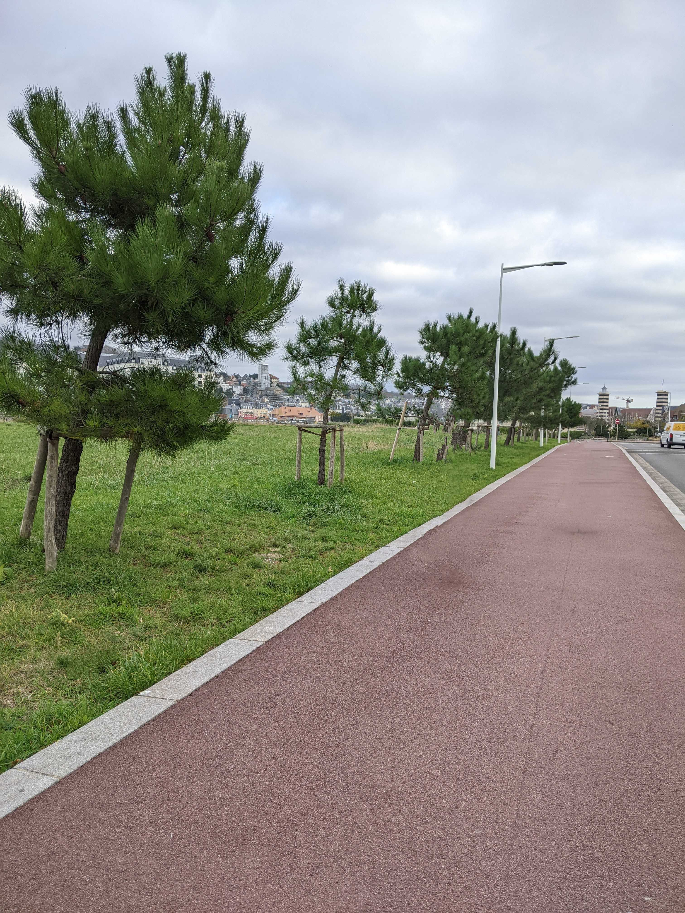

## Write up  

My first instinct with any image is to check its metadata, but no luck here on this one as there was no useful information.

Looking at the image, the first thing that jumps out are these two vertical structures that look like lighthouses :

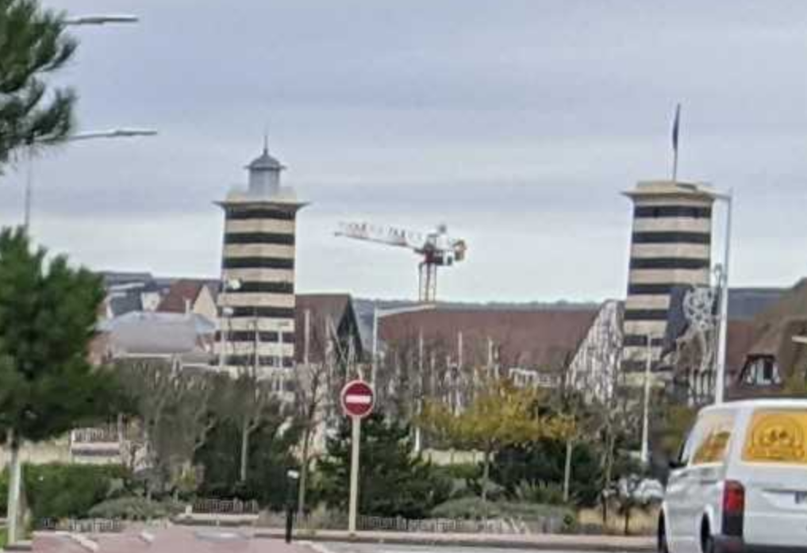

With a quick reverse image search we end up finding that these are the [belvédères of Deauville](https://g.co/kgs/VRbXdhp) 

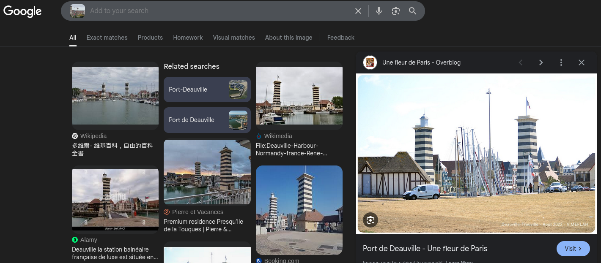

Digging further into it, we learn that they are located near [Deauville's harbor](https://www.google.com/url?sa=t&source=web&rct=j&opi=89978449&url=/maps/place//data%3D!4m2!3m1!1s0x47e1d51e068b0a6f:0x1f968b5cba2460c0%3Fsa%3DX%26ved%3D1t:8290%26ictx%3D111&ved=2ahUKEwil66iZ7vqNAxXRWqQEHSVDNpYQ4kB6BAg3EAM&usg=AOvVaw0AO6V4JQHpdKjAK4JPSbgr)

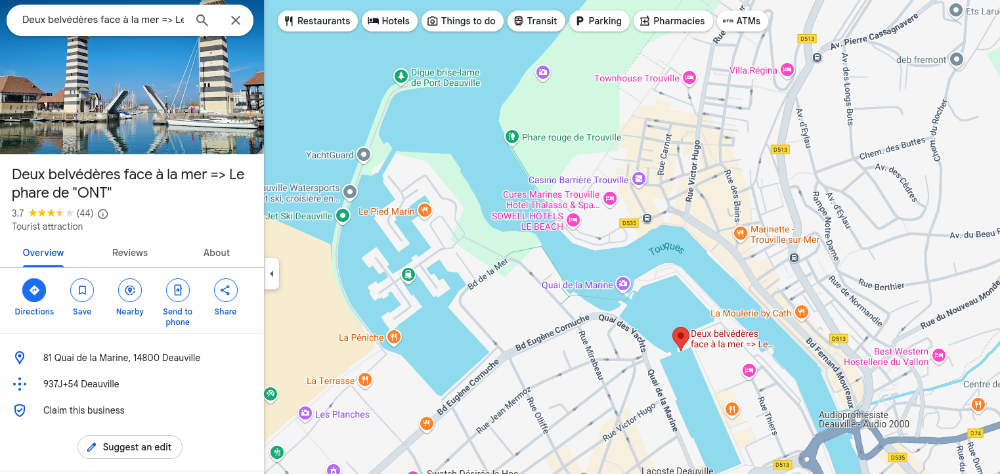

Since they don't seem to be very tall buildings, we can assume that the picture was taken nearby.

Looking a bit more at the picture, we notice a second interesting element : 

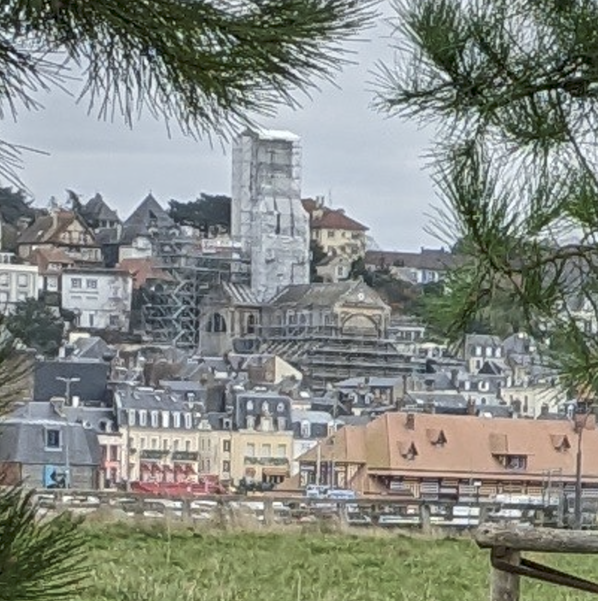

This appears to be a church undergoing restoration.

Searching `Church restoration Deauville` leads us to [this article](https://trouville-deauville.maville.com/actu/actudet_-l-eglise-notre-dame-des-victoires-entame-sa-transformation-a-trouville-sur-mer-_fil-6018646_actu.Htm) : 

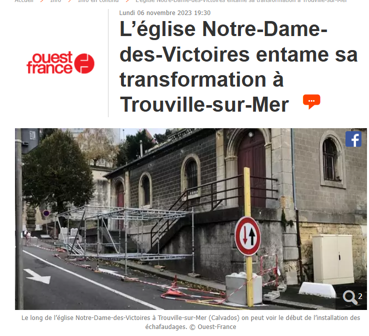

Looking up [église Notre-Dame-des-Victoires Deauville](https://www.tripadvisor.fr/Attraction_Review-g187187-d12610474-Reviews-Eglise_Notre_Dame_Des_Victoires-Trouville_sur_Mer_Deauville_Calvados_Basse_Norma.html) on google confirms that this is what we're seeing : 

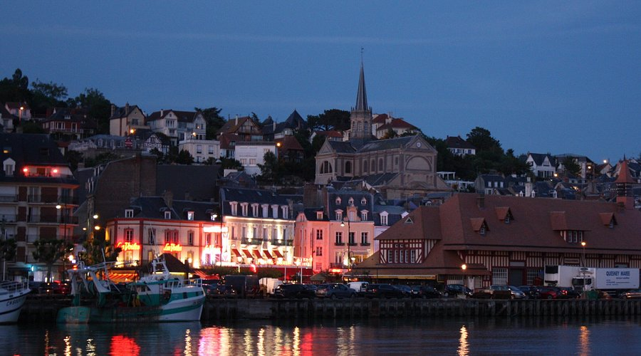

And it is located [here](https://www.google.com/maps/place/%C3%89glise+Notre-Dame-des-Victoires+de+Trouville/@49.3655239,0.0820344,16.25z/data=!4m6!3m5!1s0x47e1d4aad5c026fb:0xc2278840f21a5622!8m2!3d49.3650395!4d0.0843833!16s%2Fg%2F11h2g21pbh?entry=ttu&g_ep=EgoyMDI1MDYxNi4wIKXMDSoASAFQAw%3D%3D) : 

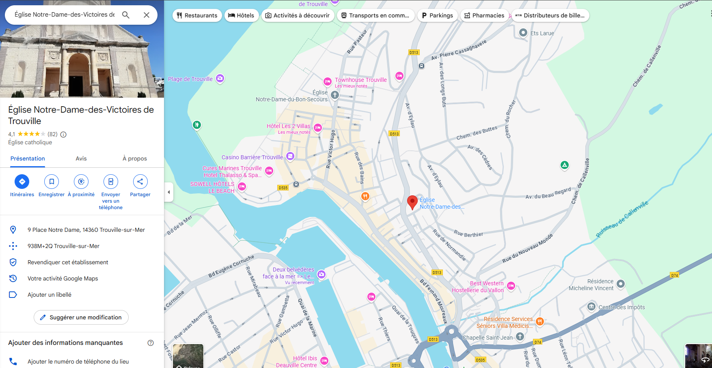

---
In the original photograph, the **church** appears on the *right* and the **Belvédères** on the *left*, which narrows the search area to: 

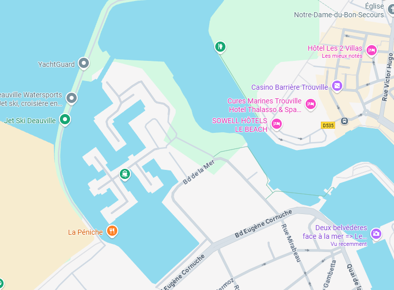

Exploring around in streetview, we end up on [this road](https://maps.app.goo.gl/oyp8VydqcCd6xu3w5) that looks awfully similar to the original picture : 

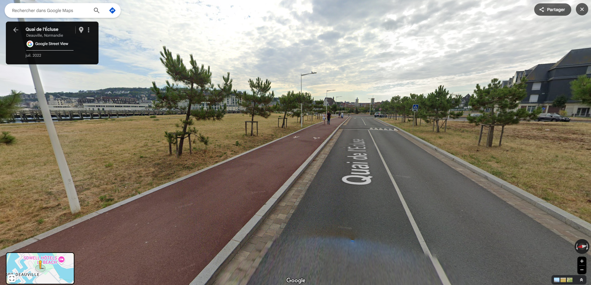  

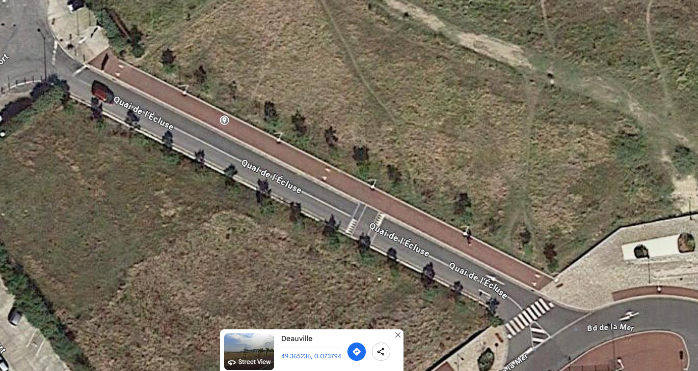

We then go over to [What3word](https://what3words.com/) and look for our spot. We need to be precise: 
- The photograph was taken on the sidewalk
- Between the 4th and 5th lampposts from the roundabout 
- 3 trees away from the 4th lamppost.

By turning on the satellite view we can manage to get a better look at our spot : 

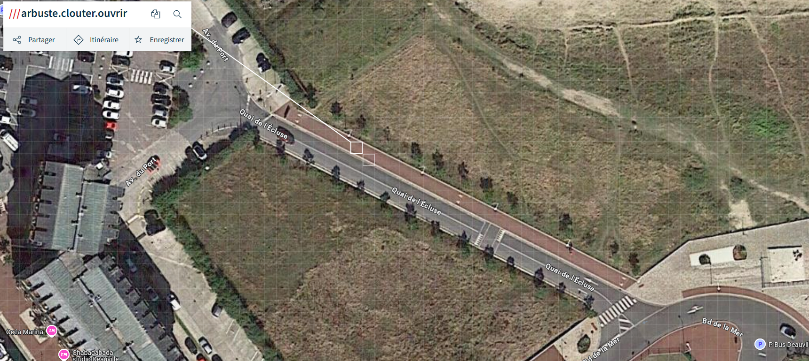

By accurately placing the marker, we get our three-word address: `arbuste.clouter.ouvrir`

## Results 

Therefore, the flag is:

`AMSI{arbuste.clouter.ouvrir}` 

Thank you to the [AMSI Team](https://www.linkedin.com/company/association-du-master-s%C3%A9curit%C3%A9-informatique/) for coming up with this challenge