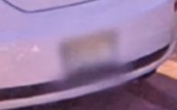
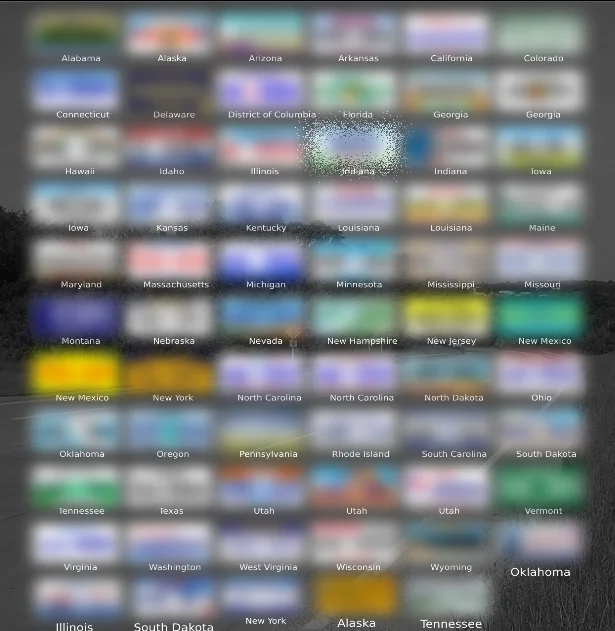
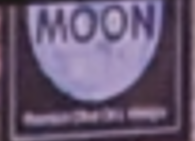
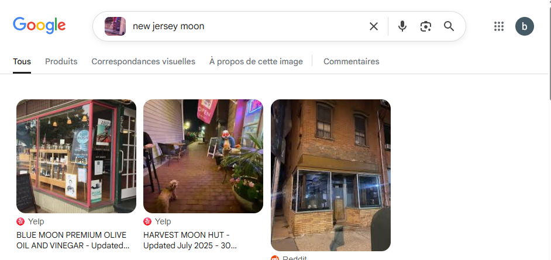
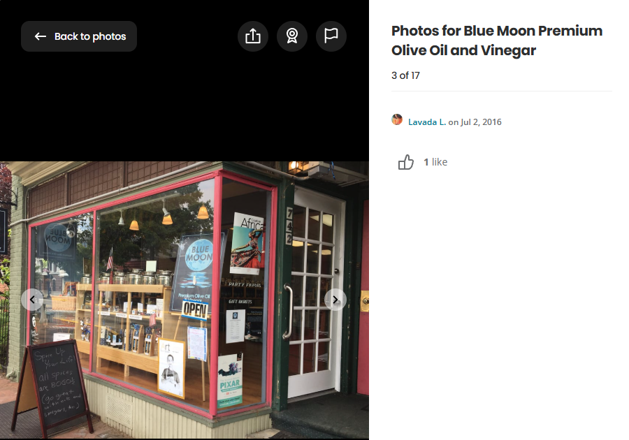
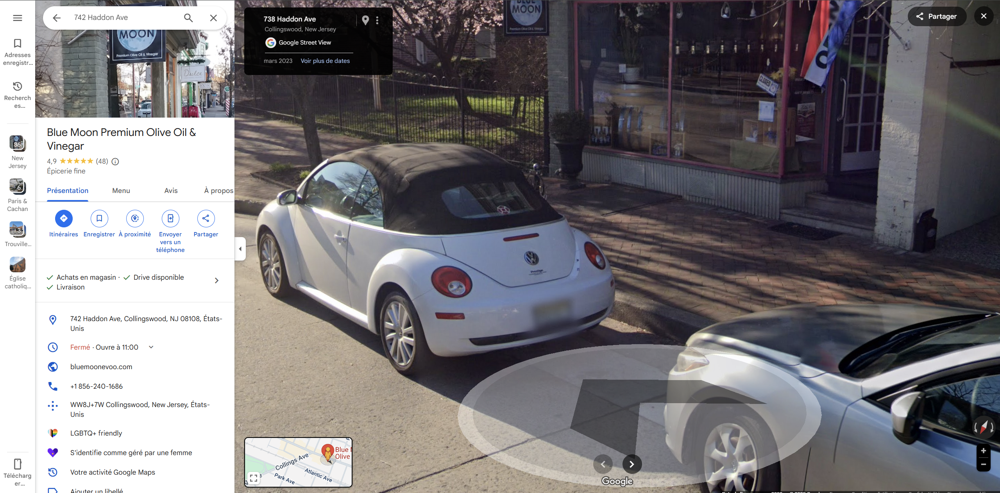

# AMSI CTF 2025 - OSINT : Trouvé! Ah non enfaite

- Write-Up Author:  [Atlas](https://github.com/Atlas002) - [0xECE - CyberSharks](https://ctftime.org/team/389816)

- All credits for the challenge go to [AMSI](https://www.linkedin.com/company/association-du-master-s%C3%A9curit%C3%A9-informatique/)

Flag

AMSI{742_Haddon-Ave_Collingswood}

## Challenge Description:

Le C3N a fait appel a un spécialiste OSINT aussi compétent que vous pour cette mission. Un agent de la DGSI a réussi à photographier l'écran de l'ordinateur portable du criminel à bord d'un vol au départ de CDG et à destination de l'aéroport de NYC. L'écran révèle le lieu de rendez-vous avec son complice. Il est crucial de déterminer l'emplacement exact montré sur l'image afin que les autorités américaines puissent se coordonner et l'intercepter à temps.

Format du flag : AMSI{numéro_rue_ville}

Exemple : AMSI{100_Houston-Ave_Oak-Ridge}

## Write up  

Looking at the image, we can notice several things that will help us narrow down our research : 

### Part 1 - License Plate

The blurred colored license plate is strongly hinting that we are in the US 

We notice it has a yellow top with a white lower part. Looking through [this website]() and cross referencing with this image, we can determine it is a **New Jersey License plate**. 

### Part 2 - Store Logo

Looking at the top of the picture, we see a cropped logo of the store we're in front of where we can read the bottom part : `Moon`

Now, doing a reverse image search of the store front with the text `new jersey moon` leads us to this :

The first result seems very promising, heading over to the [Yelp page](https://www.yelp.com/biz/blue-moon-premium-olive-oil-and-vinegar-collingswood) confirms our findings : 

From the same page we then also get an adress : `742 Haddon Ave Collingswood, NJ 08108`

Heading over to that adress on maps confirms we're on the right spot :

Same tree, same car, same storefront.

## Results

`AMSI{742_Haddon-Ave_Collingswood}`