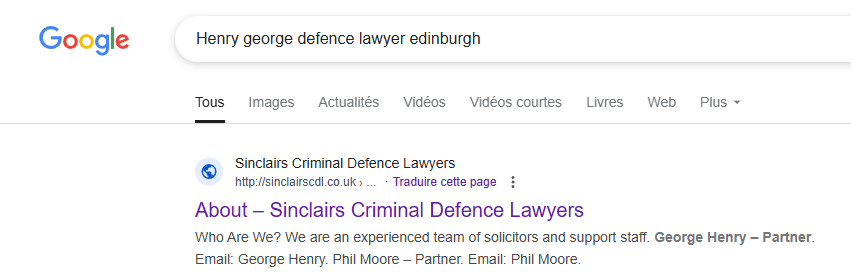
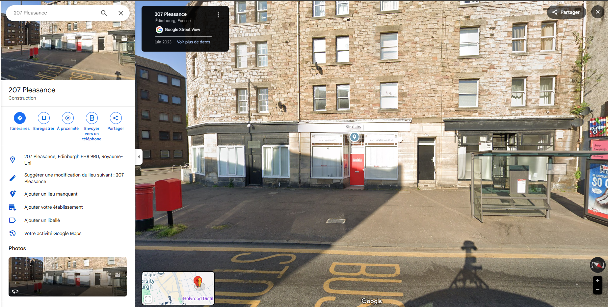

# BITSCTF 2025 - OSINT : The Sonnets Secret

* Write-Up Author: [Atlas](https://github.com/Atlas002) - [0xECE - 3](https://www.linkedin.com/company/asso0xece/posts/?feedView=all)
* All credits for the challenge go to [BITSkrieg](https://www.linkedin.com/company/bitskrieg/posts/?feedView=all).

<details>

<summary>Flag</summary>

BITSCTF{Sinclairs}

</details>

## _**DISCLAIMER**_

This OSINT challenge involves a _**REAL PERSON**_.\
Do not _**CONTACT**_ , _**HARASS**_ , _**INTERACT**_ or _**IMPERSONATE**_ this person.

## Challenge Description:

In misty glens where thistles grow,\
A tale of treachery, dark and low.\
Where stone walls whisper ancient lore,\
Of crowns that fell to rise no more.

Seek ye the place where rivers meet,\
Where royal blood once stained the street.\
A castle's shadow looms nearby,\
Its secrets locked in mortar dry.

Not Elsinore, but kindred shame,\
Where kinsmen plotted, took their aim.\
The crown did fall, a nation reeled,\
In Scotland's heart, the truth concealed.

Where cobbles echo footsteps past,\
And ghosts of kings their shadows cast,\
The answer lies, if you dare seek,\
In halls where history doth speak.

Find where the old and new entwine,\
Where modern glass meets ancient spine.\
The murder's stage, now tourist's fare,\
Reveals itself to those who dare.

Beneath the mist of ages gone,\
A city's heart still beats on,\
Where alleys twist and chimneys smoke,\
And ancient stones their tales invoke.

Seek ye the place where justice dwells,\
In chambers where the truth compels,\
A door of crimson, walls of white,\
Guard secrets of that fateful night.

Near where the deed was darkly done,\
A guardian of rights has won,\
His fortress stands, a beacon bright,\
For those who'd challenge crown and might.

In shadows of the old town's reach,\
Where history and present meet,\
The answers to this riddle lie,\
For those with keen and searching eye.

Not far from where the monarch fell,\
A modern Portia casts his spell,\
With crimson door and snowy wall,\
He stands where justice casts its pall.

Defender of the accused and shamed,\
This legal eagle, justly famed,\
Near murder's ground, both old and new,\
Awaits to give the devil his due.

A gentleman of law, not dame,\
His office near the scene of shame,\
Where ancient wrongs and modern plights,\
Find voice in his impassioned fights.

His name, a regal echo strong,\
Of kings who ruled when knights were young,\
A Henry bold, with George before,\
Defends where once a crown was wore.

Now seek the plate upon the door,\
The final clue you're searching for,\
What name is etched in letters clear?\
The answer to our riddle dear.

## Write up

## Write-up

### Part 1 - Interpreting the Clues

_Caveat:_ I wrote this write-up several months after the CTF took place. I am reconstructing my original thought process as accurately as possible.

This challenge mainly relies on deduction and reading between the lines. We'll try to look into the relevant bits of the poem:

```
Where royal blood once stained the street.
```

```
Where kinsmen plotted, took their aim.  
The crown did fall, a nation reeled, 
```

* [Murder of Lord Darnley in Edinburgh, Scotland](https://en.wikipedia.org/wiki/Murder_of_Lord_Darnley)

```
In Scotland's heart, the truth concealed. 
```

* Capital of Scotland, Edinburgh

```
Find where the old and new entwine,
Where modern glass meets ancient spine.
```

* Murder took place in the [Old Provost's House of The Collegiate Church of St Mary in the Fields](https://en.wikipedia.org/wiki/Kirk_o'_Field), now the [Old College](https://en.wikipedia.org/wiki/Old_College,_University_of_Edinburgh), a tourist destination, which confirms our findings.

.png>)

```
In misty glens where thistles grow,
```

* Thistle, [national flower](https://www.visitscotland.com/things-to-do/attractions/arts-culture/thistle) of Scotland

```
Seek ye the place where justice dwells,  
In chambers where the truth compels,
```

* `Justice`, `chambers` : we are probably looking for a law office

```
A door of crimson, walls of white,  
Guard secrets of that fateful night.  
```

* Red door with white wall close to the secret?

```
A guardian of rights has won,  
```

* Someone defending rights, lawyer?

```
In shadows of the old town's reach,  
Where history and present meet,  
The answers to this riddle lie,  
```

* Somewhere in or near Edinburgh's old town (here in dark brown on the map)

.png>)

```not
A modern Portia casts his spell,  
```

* [Portia](https://en.wikipedia.org/wiki/Portia_\(The_Merchant_of_Venice\)), a character in the play _The Merchant of Venice_, assumes the role of a lawyer during the 4th act of the play.

```
With crimson door and snowy wall,  
He stands where justice casts its pall. 
```

* Again with the white walls and red door

```
Defender of the accused and shamed,  
This legal eagle, justly famed,
```

* we can assume he's a defence lawyer

```
A gentleman of law, not dame,  
His office near the scene of shame, 
```

* We're looking for a man

```
His name, a regal echo strong,  
[...]  
A Henry bold, with George before,  
```

* `Henry [...] with George before` : we can assume his name is `George Henry`.

```
Now seek the plate upon the door,  
The final clue you're searching for,  
What name is etched in letters clear?  
The answer to our riddle dear.  
```

* The flag is a name on the plate above a door

***

### Part 2 - Piecing it all together

Okay, so to resume what we found :

* We're looking for a **defence lawyer**
* His name is **George Henry**
* His office is in **Edinburgh, Scotland**, in or near the **Old Town**, and has **white walls** and a **red door**.

When looking up `George Henry defence lawyer Edinburgh` on Google, our first result is this:



Clicking on the [link](http://sinclairscdl.co.uk/wp2/?page_id=2) leads us to the law firm's website, where we can see the mention of our `George Henry` which seems to be a partner at the firm:


We also get an address: `207 Pleasance, Edinburgh, EH8 9RU`\
Putting this into maps and looking in street view leads us here :



Looking closer, we can see our fabled white walls and red door, as well.


And for the name on the plate above the door, we get our flag: **Sinclairs**.

## Results

From our investigation, we can assume the flag to be :

`BITSCTF{Sinclairs}`

Thank you for reading this far, again, huge props to [BITSkrieg](https://www.linkedin.com/company/bitskrieg/posts/?feedView=all) for coming up with this challenge.
