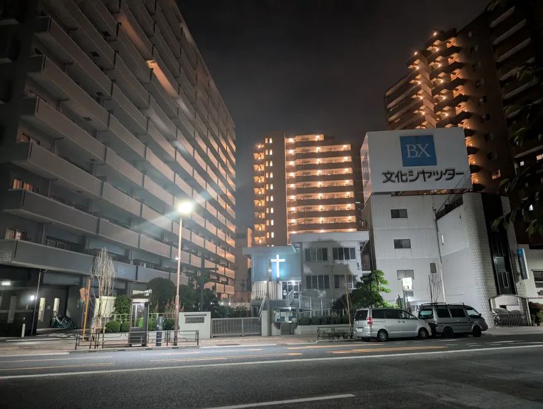
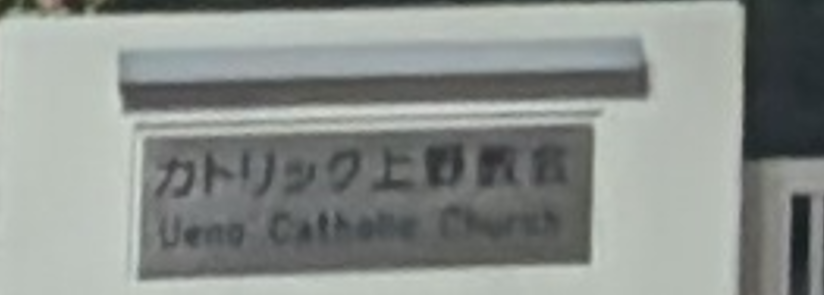
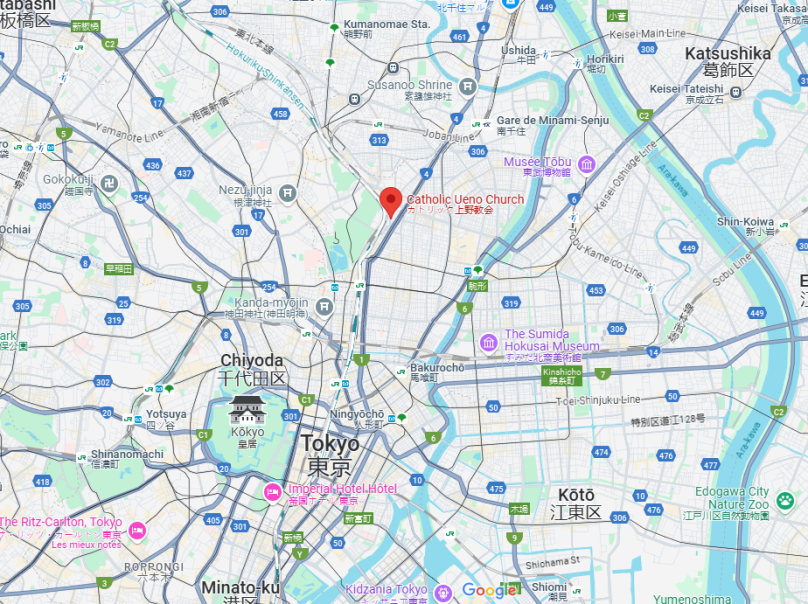
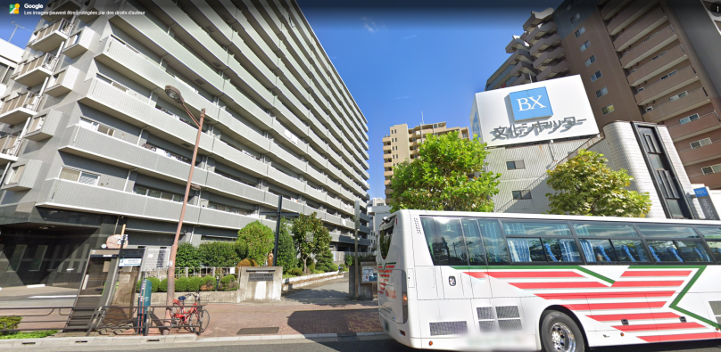
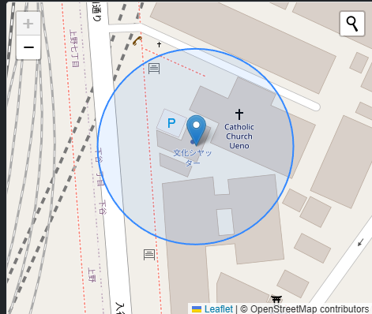

# DIVER OSINT 2025 - Intro :  Bx

- Write-Up Author:  [Atlas](https://github.com/Atlas002) 

- All credits for the challenge go to [the Diver OSINT team](https://diverctf.org/).

## Challenge Description:

Give the coordinates of the "BX" signboard visible in this picture.

## Write up  

From the writing below the "BX" sign, we can deduce that the picture has been taken somewhere in japan.

TO try and pinpoint it's location, we look around the picture, and we can see next to it a building with a neon cross on it, leading us to believe this is a church. 

Culturally speaking, catholic churches are not that common in Japan, so that may help us narrow down the location. 

Looking closer at the bottom left of the picture, we can see a plaque in front of the church : 

On it we can read "Ueno Catholic Church", and looking it up on google map gives us a direct hit near Tokyo : 

Looking at the street view of the place confirms that this is the correct location :

We then drop a pin on the correct location on the CTF's website to flag the challenge :

