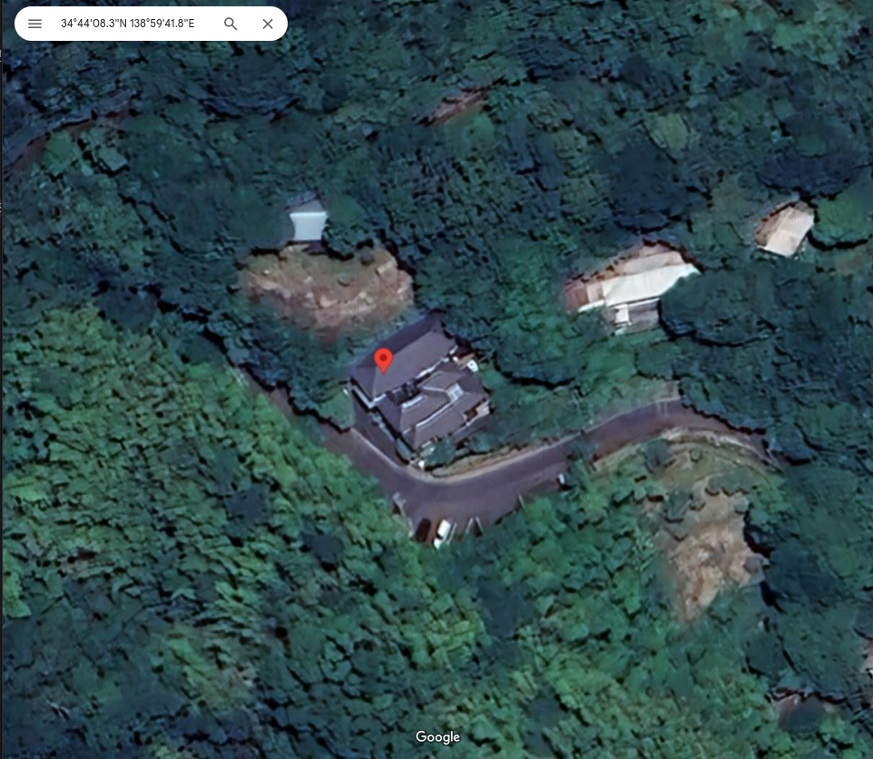
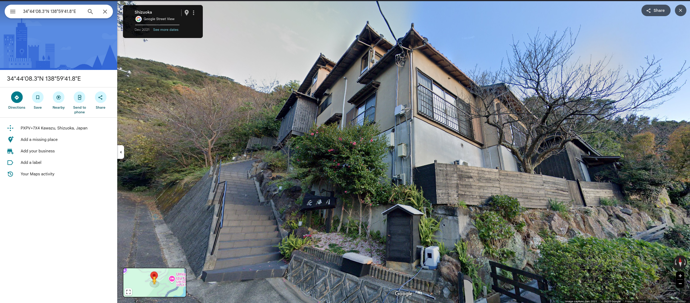
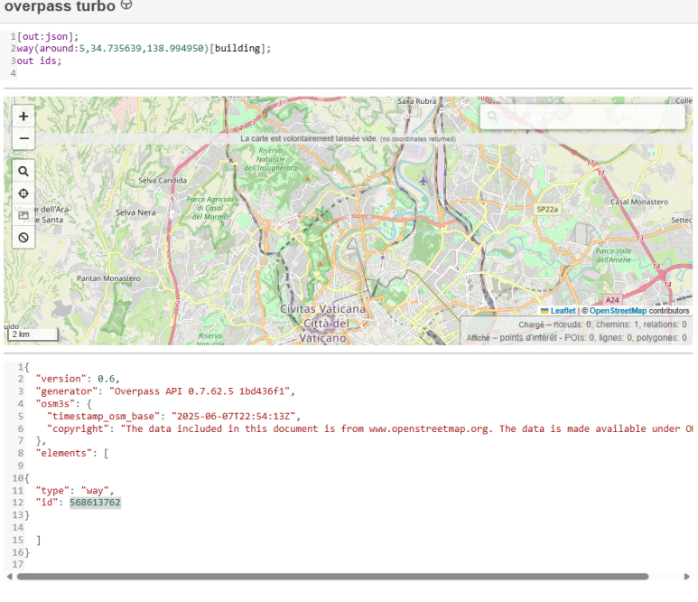

# DIVER OSINT 2025 - Intro : Finding My Way

* Write-Up Author: [Atlas](https://github.com/Atlas002)
* All credits for the challenge go to [the Diver OSINT team](https://diverctf.org/).

<details>

<summary>Flag</summary>

Diver25{568613762}

</details>

## Challenge Description:

Answer the Way number in OpenStreetMap of the building located at 34.735639, 138.994950.

Flag Format: Diver25{123456789}

## Write up

First looking up the place on Google Maps leads us to this place :





Since the challenge description mentions the use of OpenStreetMap, we can use the [Overpass Turbo](https://overpass-turbo.eu/) tool to query OpenStreetMap's API.

We use the following json script to get the closest way number to the coordinates that we were given :

```json
[out:json];
way(around:5,34.735639,138.994950)[building];
out ids;
```

We then get this result :



```json
{
  "version": 0.6,
  "generator": "Overpass API 0.7.62.5 1bd436f1",
  "osm3s": {
    "timestamp_osm_base": "2025-06-07T22:54:13Z",
    "copyright": "The data included in this document is from www.openstreetmap.org. The data is made available under ODbL."
  },
  "elements": [

{
  "type": "way",
  "id": 568613762
}

  ]
}
```

We then get the way number **568613762** , giving us our flag.

## Results

`Diver25{568613762}`
