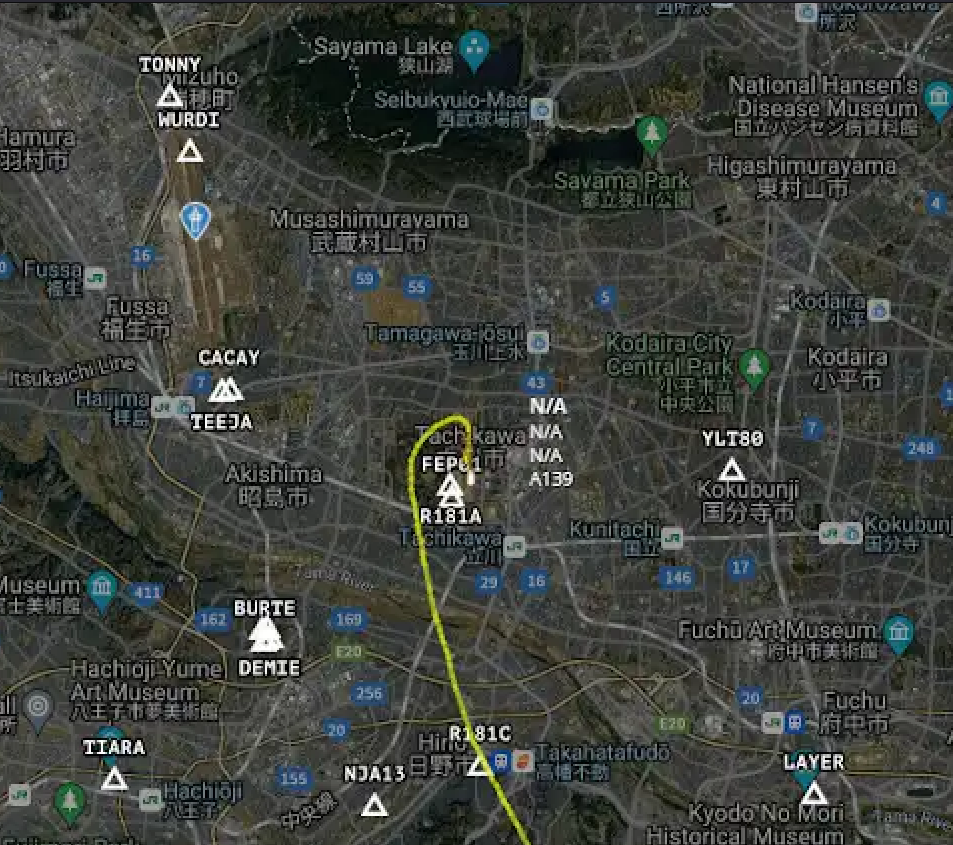

# DIVER OSINT 2025 - Intro : Flight From

* Write-Up Author: [Atlas](https://github.com/Atlas002)
* All credits for the challenge go to [the Diver OSINT team](https://diverctf.org/).

Flag

Diver25{RJTC}

## Challenge Description:

Answer with the ICAO code (4 letter code) of the airfield from which this helicopter departed.\
Flag Format: Diver25{RJTT}

.png>)

## Write up

Looking at the picture, we can look at the top left corner for a look at the heli. We can see that this is a Doctor-Heli, aka a medical transportation helicopter, most possibly based in Tokyo.

With a [quick search](https://www.google.com/search?client=firefox-b-e\&channel=entpr\&q=where+are+doctor+heli+based+in+tokyo), we find out that Tokyo Doctor Helicopters fly out of [Tachikawa Airfield](https://en.wikipedia.org/wiki/Tachikawa_Airfield).

Looking up the airfield on Google Maps, we cna see that it's location lines up with the departure point of the heli we're tracking :

.png>)

Having confirm that the helicopter departed from **Tachikawa Airfield**, we look up it's ICAO code, **RJTC**, thus giving us our flag.

## Results

`Diver25{RJTC}`
