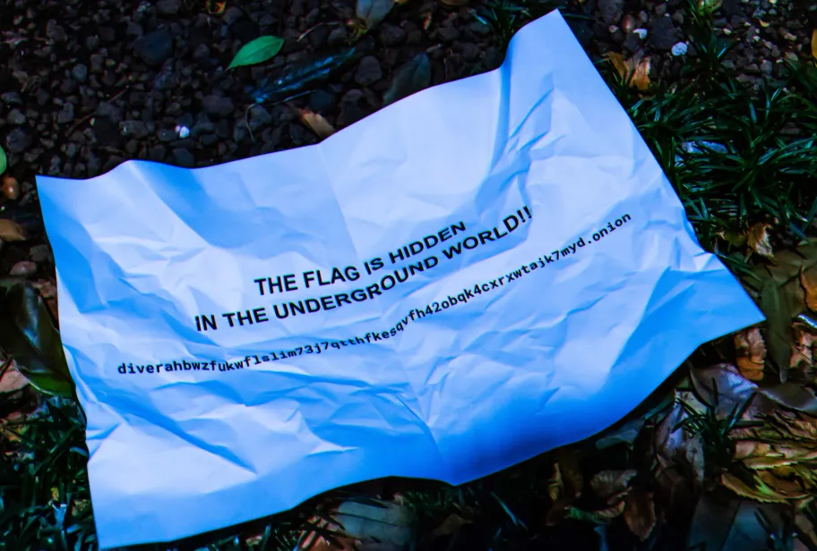
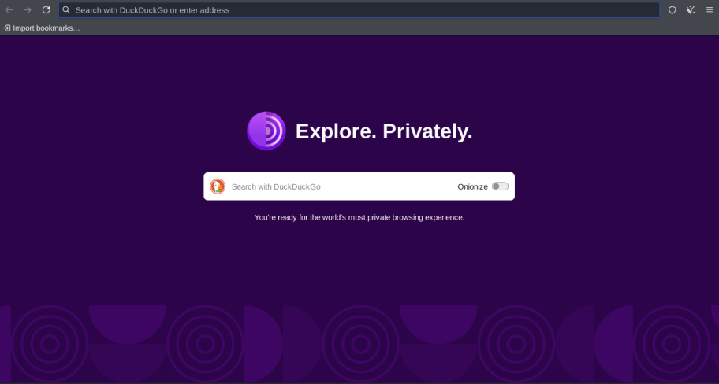
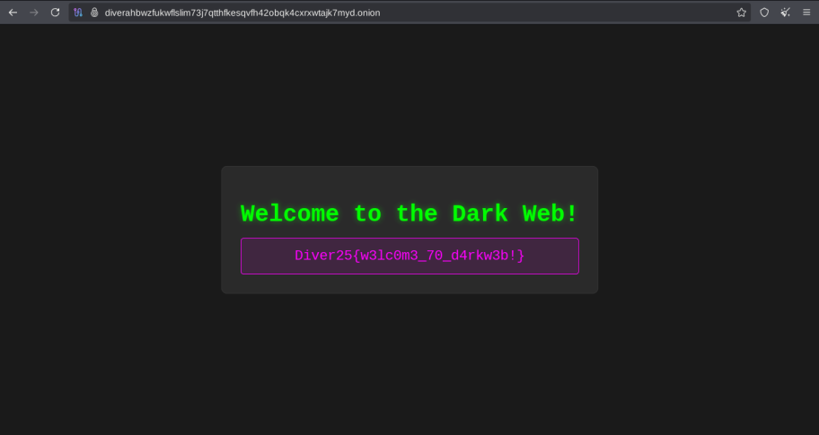

# DIVER OSINT 2025 - Intro :  Hidden Service 

- Write-Up Author:  [Atlas](https://github.com/Atlas002) 

- All credits for the challenge go to [the Diver OSINT team](https://diverctf.org/).

Flag

Diver25{w3lc0m3_70_d4rkw3b!}

## Challenge Description:

See the attached file and capture the flag!  
Flag Format: Diver25{xxxxxxxxxxxxxxxxx}

## Write up  

On the provided picture, we can read the message `"The flag is hidden in the underground world!"` followed by what looks like like a web adress.

Looking at that web adress, we can see that it ends in `.onion`, meaning it's an adress that would only be reachable using the Tor network. 

We then fire up our prefered onion browser and enter the following adress : ` http://diverahbwzfukwflslim73j7qtthfkesqvfh42obqk4cxrxwtajk7myd.onion/`

We then end up on a web page and get our flag :

## Results

`Diver25{w3lc0m3_70_d4rkw3b!}`

