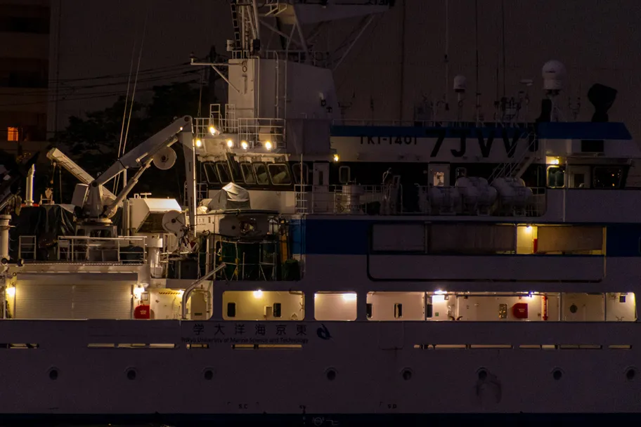
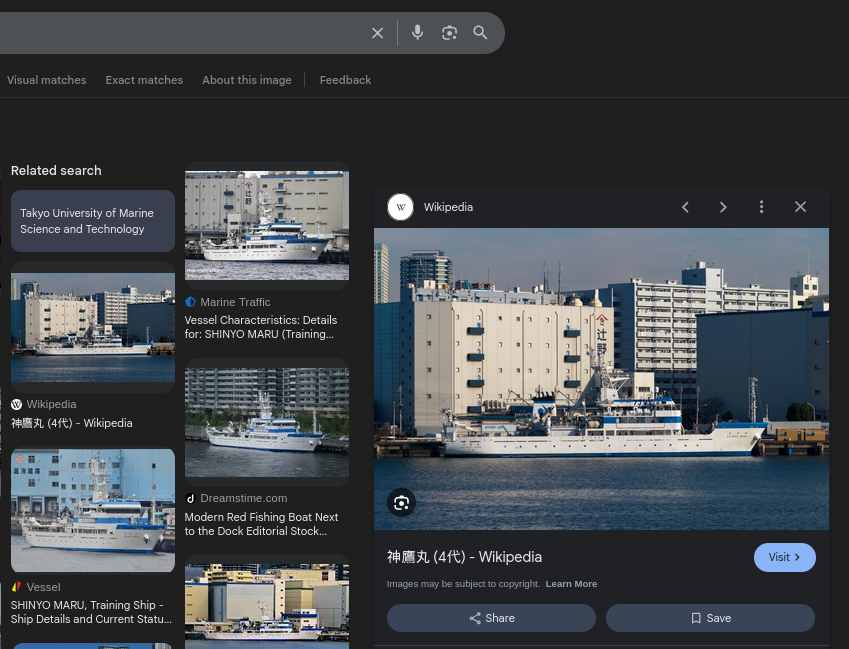
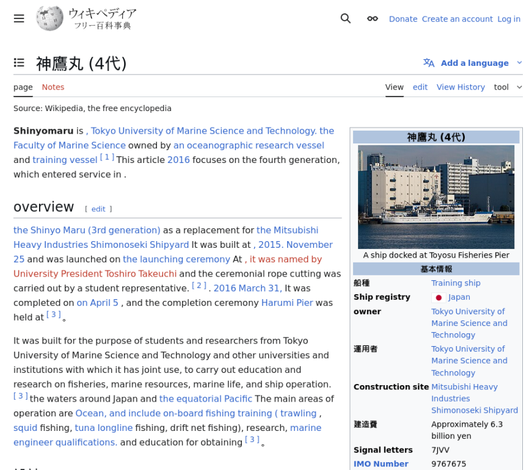

# DIVER OSINT 2025 - Intro : Ship

- Write-Up Author:  [Atlas](https://github.com/Atlas002) 

- All credits for the challenge go to [the Diver OSINT team](https://diverctf.org/).

Flag

Diver25{神鷹丸_9767675}

## Challenge Description:
This is a vessel operated by a some organisation. Answer the number that would remain the same if this vessel were to be sold to a foreign country in the future.

Flag Format: Diver25{ship name in the local language_number}  
(e.g. If the ship name is "ペンギン饅頭号" and the number is 1234567, the flag should be Diver25{ペンギン饅頭号_1234567}.)

## Write up  

To summarize what we are looking for, we need to find the ship's local name and the number that wouldn `"remain the same if sold to a foreign country"`.

Doing [some research](https://en.wikipedia.org/wiki/Ship_identifier) on the subject, we learn that IMO numbers never change even after an international sale. So we need to find the IMO number of that ship.

Looking closer at the image, we can see that this ship has `Tokyo University of Marine Science and Technology` written on his side. We can assume that it's a training boat used by [TUMSAT](https://www.kaiyodai.ac.jp/en/)

Doing a reverse image search on the picture leads us to this Wikipedia page : 

This seems to be the wikipedia page of the precise boat we're looking for : the **Shinyomaru IV**.  
When translated, it reads like this :  

We then find the local name of the ship : **神鷹丸**  
As well as its IMO number : **9767675**

Assembling the two give us our flag. 

## Results

`Diver25{神鷹丸_9767675}`

