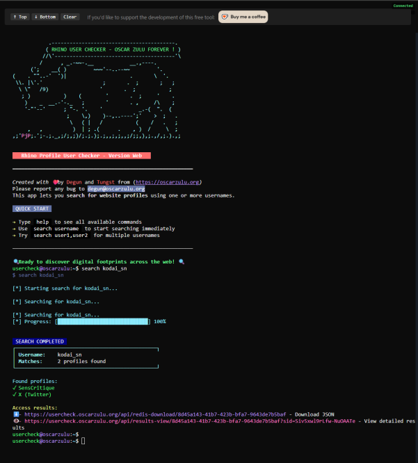
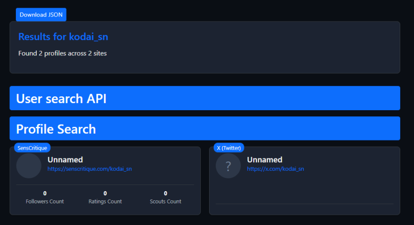
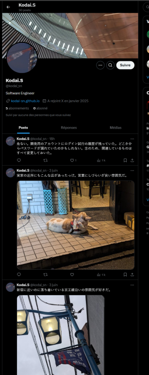
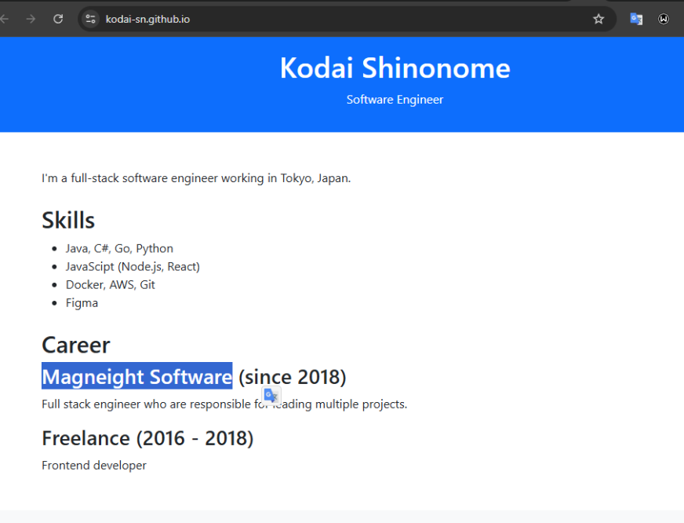

# DIVER OSINT 2025 - Recon : 00 - Engineer

* Write-Up Author: [Atlas](https://github.com/Atlas002)
* All credits for the challenge go to [the Diver OSINT team](https://diverctf.org/).

Flag

Diver25{https://magneight.com}

## Challenge Description:

An software engineer's nameplate was picked up near Tokyo Station. This should be a lost item.\
Answer the URL of the website (index page) of the company where this engineer works.\
Flag Format: Diver25{https://google.com}

.png>)

## Write up

We can see a handle on the badge : `kodai_sn`.

We use [Oscar Zulu's Rhino User Checker](https://usercheck.oscarzulu.org/) on it :

We see that we get a hit on a twitter account :

Heading over to his account, we can see that he's got a github link in his bio. Heading over to it we see that it's his resume :

On it we can see that he's been working at **Magneight Software** since 2018. Looking up the company we end up on [this website](https://magneight.com) :

Looking at the url, we then have our flag.

## Results

`Diver25{https://magneight.com}`
