# DVCTF2025 - OSINT : 1 - Research 

- Write-Up Author:  [Atlas](https://github.com/Atlas002) - [Les Seconds Choix](https://dvc.tf/teams/34)

- All credits for the challenge go to [DaVinciCode](https://www.linkedin.com/company/davincicode/posts/?feedView=all)

Flag

DVCTF{Ireland_Columbia_The-Five-Lamps}

## Challenge Description:

You have been found by the OCBC (Office central de lutte contre le trafic des biens culturels - Central Office for Combating Trafficking in Cultural Property). To guarantee your freedom, you must cooperate : if you manage to provide all the information relating to the investigation, no charges will be brought against you.

Last week, there was a burglary at the Musée du Louvre. The main objective of OCBC is to find stolen works before they are found on the black market.

We know from our sources that it would be a certain Willow Wool who will put the works for sale. He is one of the largest dealers in stolen art, and he does not act alone.

Your investigation will start by finding in which country he is located, in which town is the head office of his workplace, as well as the monument closest to his current place of "work".

Flag format : DVCTF{Country_Town_Monument}

## Write up  

### Part 1/3

We start the challenge with only one piece of information: the username **Willow Wool**.

A formal google search will yield you little to nothing (except if you're in the market for a wool scarf), so on we go to search socmint sources.

Using [Oscar Zulu](https://www.linkedin.com/company/oscar-zulu-osint/posts/?feedView=all)'s wonderfull [Rhino User Checker](https://usercheck.oscarzulu.org/) and searching for the username `Willow-Wool`, we end up with the following result : 

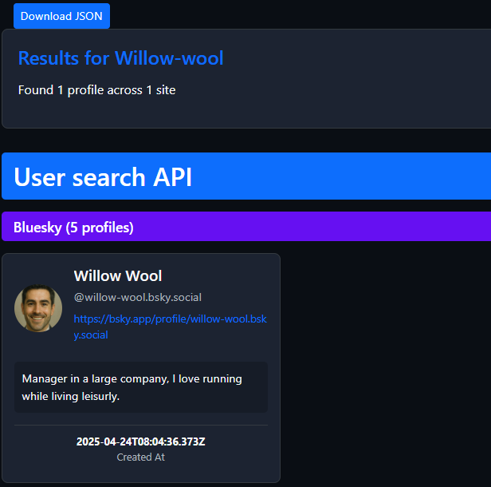

*(Not a good habit but looking at the creation date of the account is a good sign we're on to something.)* 

Checking the bluesky account that we found leads us to [this](https://bsky.app/profile/willow-wool.bsky.social) : 

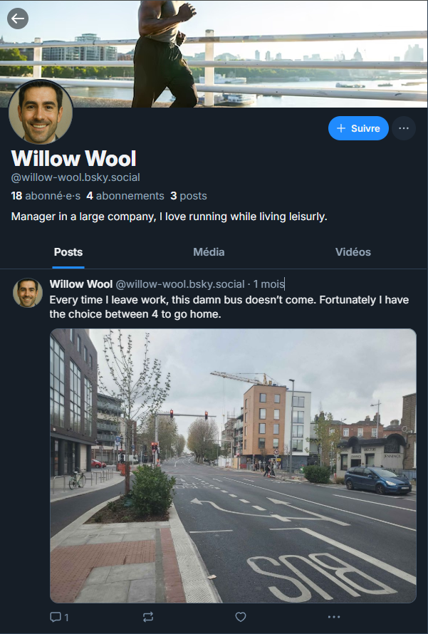 

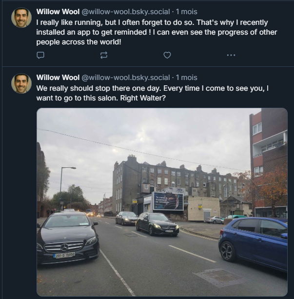  

This is nothing short of a gold mine, let's recap what we've found :
- The guy's a manager at a large company
- He loves running
- He's pissed at public transit (understandable)

We also get two pictures, which could give us information about the first part of the flag (which country he is located). Now, time for some geoint: 

Since there are no apparent flags or street signs to be seen, we refer to our best bet: cars. As we can see, the license plates have a white background with a vertical blue strip on the side, typical of EU countries. 

  
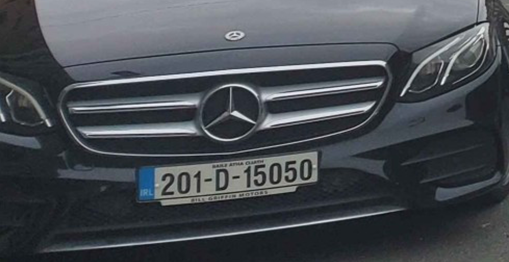   

Looking closer, we can see 3 letters `IRL` on the strip, which tells us (in accordance with the irish gaelic text that can be seen on the billboard in the background) that we are in **Ireland**.

---
### Part 2/3

This is good! We've done 1/3 of the work, let's keep going.

The second part of the flag is "which town is the head office of his workplace", so let's look back at his other post:  

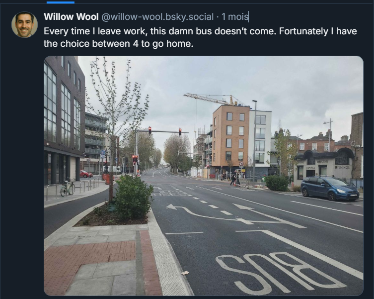 

With the post's description talking about commute, we can assume the picture was taken very close to his workplace. Again, no street signs to go off of there, and very little named building to anchor the place in. However, there's a building we can look into :

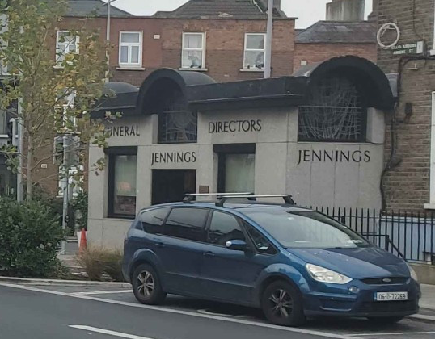

If we search `Jennings Funeral Directors Ireland` on maps, we end up with only a handfull of results, all located in Dublin :

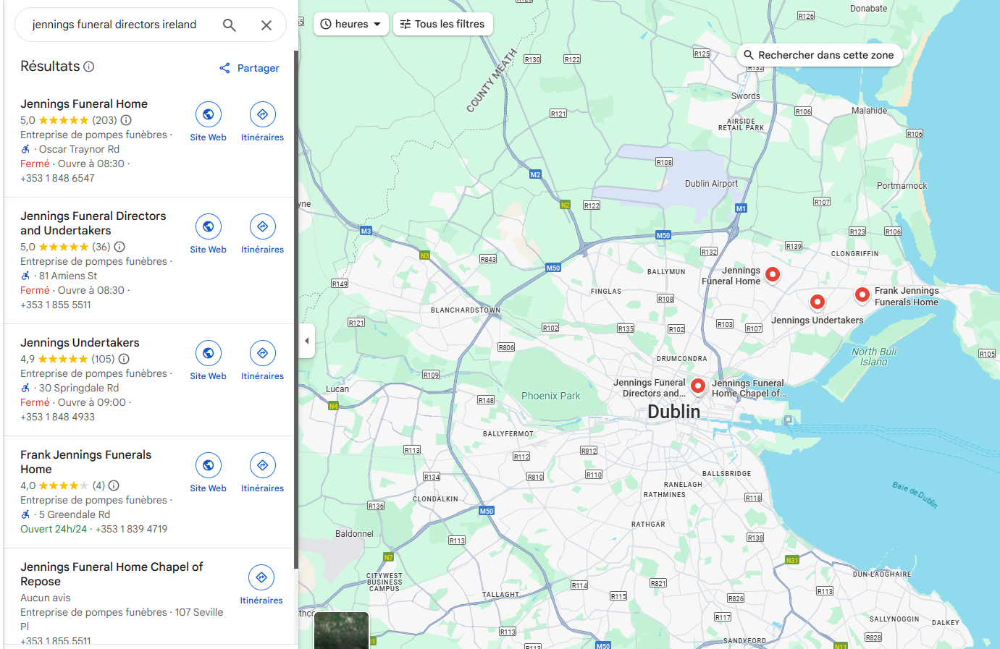 

Going through them, we find that the one located at Amiens St is the only one that ressemble ours :

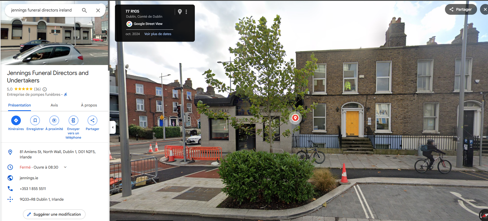 

And just looking a bit to the left, we have our bingo :

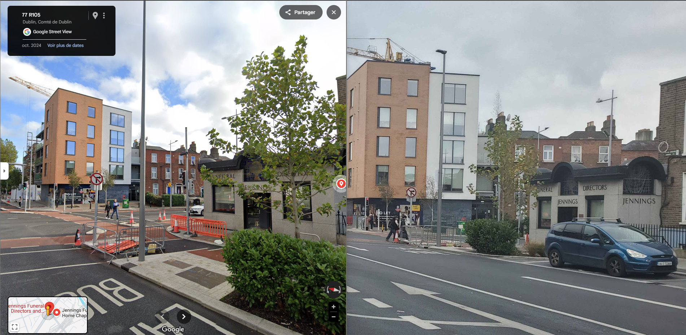 

Knowing we're in the right place, we look in the vincinity of the place to see where our man could be working. Let's remember that his bio reads `"Manager in a large company"`.

Looking around the place we found, the only one that would fit this description would be **this**:

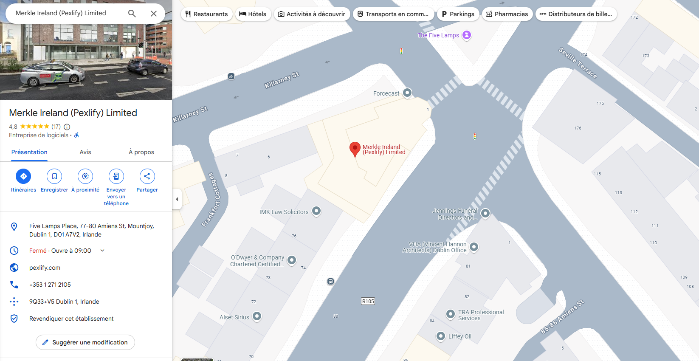 

Heading over to their listed website, this looks like a "large company" indeed : 

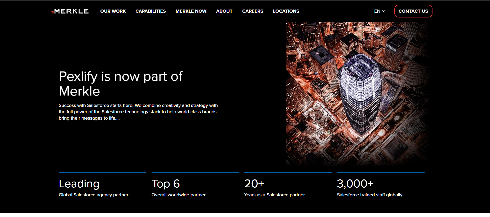   

Googling `Merkle head office` and scrolling a bit leads us to [this](https://craft.co/merkle/locations) very helpful website :

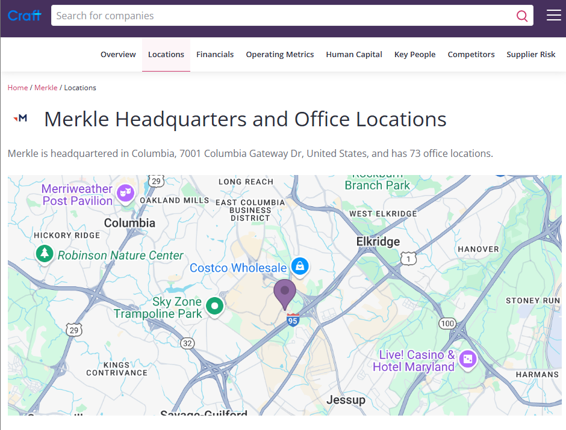   

Here it is: **Columbia**, South Carolina ! 

---

### Part 3/3

Great, we're almost done with this. The last part of the flag is "the monument closest to his current place of 'work'". 

Looking back to his office in dublin, we just look at the "monuments" listed by Maps : 

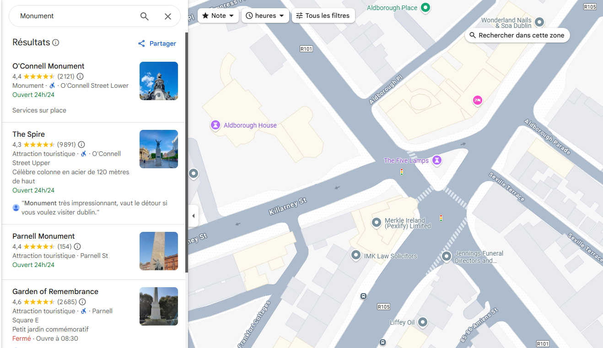   

And we see that ther closest one seems to be **The Five Lamps** ! 

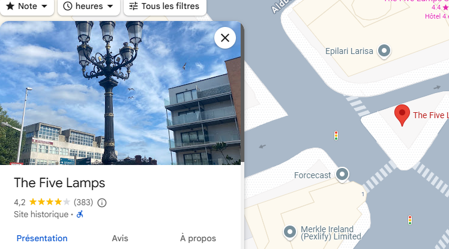   

---
## Results

With everything we found so far, we can put the flag back together : 

`DVCTF{Ireland_Columbia_The-Five-Lamps}`

Thank you for reading this far, this is my first write up so i'm open to feedback as for layout/readability! 

Again, huge props to  [DaVinciCode](https://www.linkedin.com/company/davincicode/posts/?feedView=all) for coming up with this challenge.

Sadly as I completed this at the end of day one on site, I did not complete the `2 - Accomplice` nor `3 - Raid` challenge and don't have a write up for them at the moment. 

Some congratulations are in order for our colleagues at [0xECE](https://www.linkedin.com/company/equipe0xece/) for first-blooding this challenge!

A last thank you for everyone who was on site, the vibes were incredible and see you next year ! 
