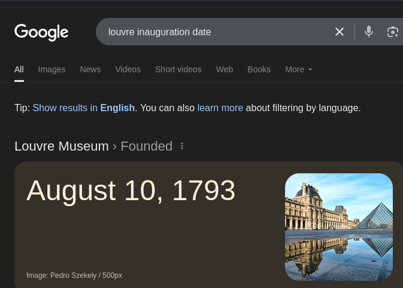
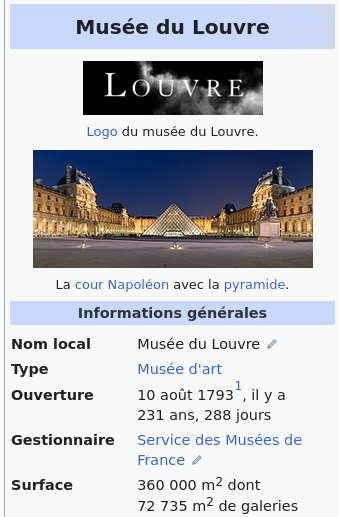

# DVCTF2025 - OSINT : A - Reconnaissance 

- Write-Up Author:  [Atlas](https://github.com/Atlas002) - [Les Seconds Choix](https://dvc.tf/teams/34)

- All credits for the challenge go to [DaVinciCode](https://www.linkedin.com/company/davincicode/posts/?feedView=all)

Flag

DVCTF{673_august_360000_ain-ghazal}

## Challenge Description:

You have been found by the OCBC (Office central de lutte contre le trafic des biens culturels - Central Office for Combating Trafficking in Cultural Property). To guarantee your freedom, you must cooperate : if you manage to provide all the information relating to the investigation, no charges will be brought against you.

Initially, you will be asked to scout the Louvre in order to understand how the museum is structured and to obtain crucial information.  
Your mission is to collect the following data : 
- Number of glass panels that make up the Louvre pyramid
- Month the Louvre was inaugurated
- Total surface area of the Louvre (in m2)
- Name of the oldest work exhibited in the Louvre

Once you have collected this data, you will need to compile it into a flag in the following format :  

Flag format : DVCTF{number-of-panels_month_total-area_piece-name}

## Write up  

### Part 1/4

We start the challenge with the first piece of the flag, that we can find with a quick Google search: 

 

We then have the first part of our flag : **673**

---
### Part 2/4

Again, we go the same route of Googling the second part of the challenge: 

 

We then have the second part of our flag : **august**

---

### Part 3/4

Same old same old, we get our answer by looking at the (French) [Wikipedia page of the Louvre](https://fr.wikipedia.org/wiki/Mus%C3%A9e_du_Louvre): 

We then have the third part of our flag: **360 000**

---

### Part 4/4

For the last part of this challenge, searching `oldest piece louvre` gets us this:

We then have the last part of the flag: **Ain Ghazal**

---
## Results

With everything we found so far, we can put the flag back together: 

`DVCTF{673_august_360000_ain-ghazal}`

Thank you for reading this far, again huge props to [DaVinciCode](https://www.linkedin.com/company/davincicode/posts/?feedView=all) for coming up with this challenge.

Thank you for everyone who was on site, the vibes were incredible and see you next year ! 
