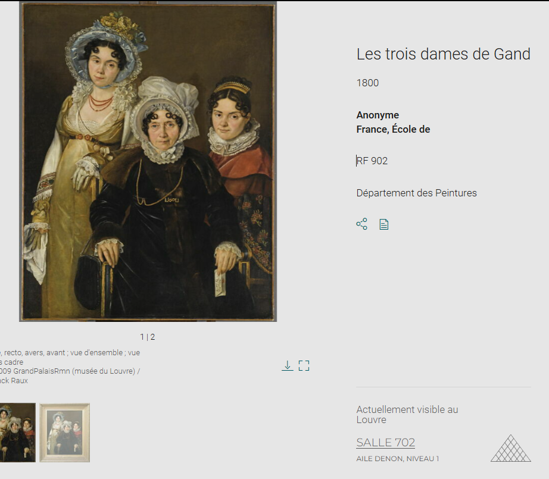
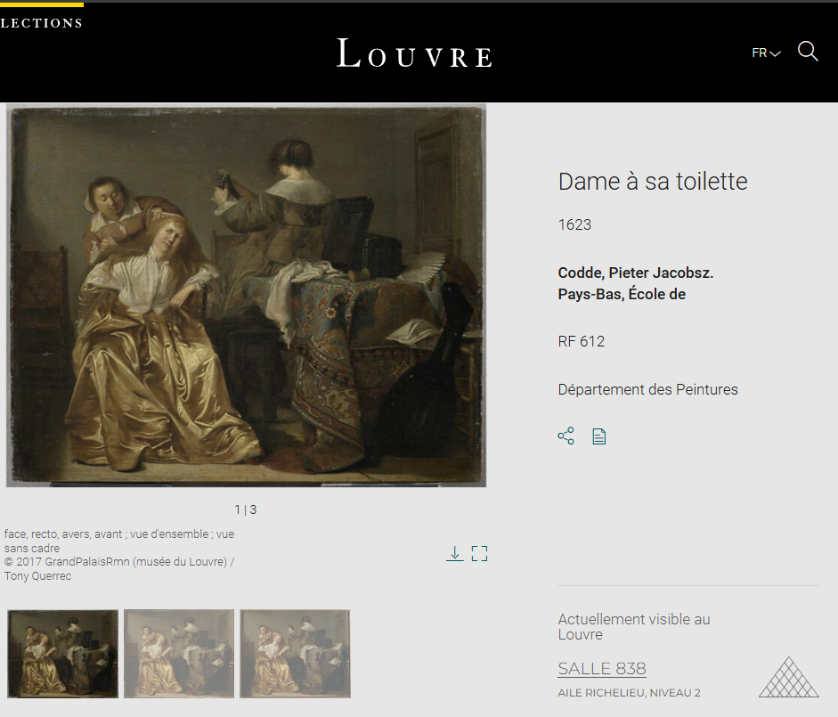
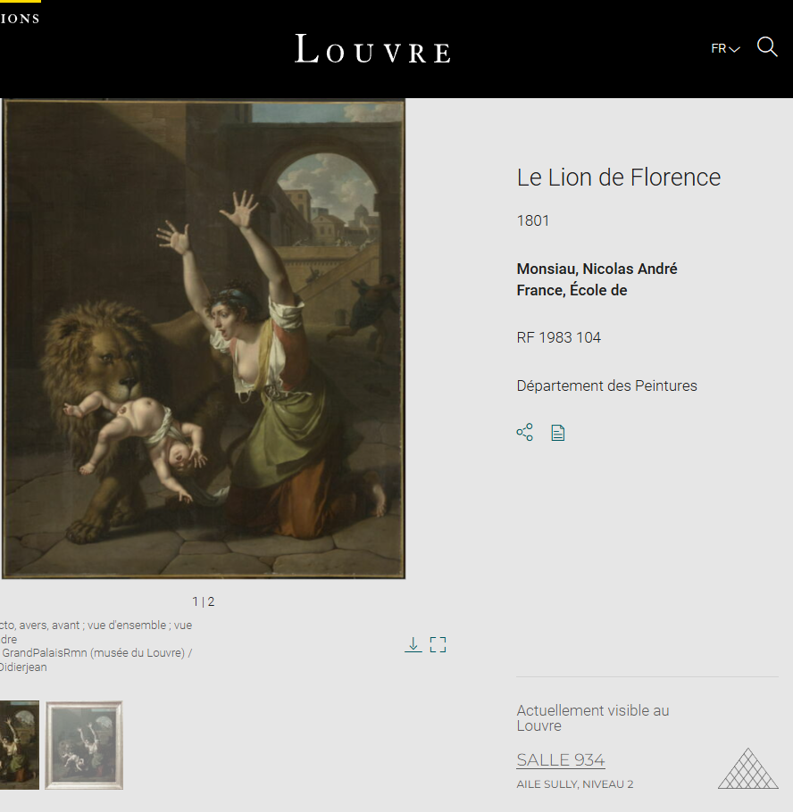

# DVCTF2025 - OSINT : B - Prevent 

- Write-Up Author:  [Atlas](https://github.com/Atlas002) - [Les Seconds Choix](https://dvc.tf/teams/34)

- All credits for the challenge go to [DaVinciCode](https://www.linkedin.com/company/davincicode/posts/?feedView=all)

Flag

DVCTF{DENON-902_RICHELIEU-612_SULLY-1983104} 

## Challenge Description:

*Disclaimer: This is a reconstitution of the challenge's description, as I do not have access to the original text as of right now.*

You have been found by the OCBC (Office central de lutte contre le trafic des biens culturels - Central Office for Combating Trafficking in Cultural Property). To guarantee your freedom, you must cooperate: if you manage to provide all the information relating to the investigation, no charges will be brought against you.

A robbery has been planned to take place soon at the Louvre, and some specific artwork is going to be targeted:
- Les trois dames de Gand (Anonymous)
- Dame à sa toilette (P. Jacobsz)
- Le Lion de Florence (N.A. France)

You will need to retrieve their RF inventory numbers and wings of the Louvre they are currently located in and compile it into a flag in the following format:  

Flag format: DVCTF{WING1-RF1_WING2-RF2_WING3-RF3}

## Write up  

### Part 1/3

We start the challenge with the first artwork, `Les trois dames de Gand` that we can find with a quick Google search that leads us to [the Louvre's Official Website](https://collections.louvre.fr/ark:/53355/cl010059203): 

 

We then have the first part of our flag: **Wing DENON and RF 902**

---
### Part 2/3

Again, we go the same route of Googling the second artwork, `Dame à sa toilette`, and end up back on the [same website as before](https://collections.louvre.fr/ark:/53355/cl010063550): 

 

We then have the second part of our flag: **Wing RICHELIEU and RF 612**

---

### Part 3/3

Same old same old, we get our answer from the [Louvre's page](https://collections.louvre.fr/ark:/53355/cl010060919) of the last artwork, `Le Lion de Florence`: 

We then have the third part of our flag: **Wing SULLY and RF 1983 104**

---

## Results

With everything we found so far, we can put the flag back together: 

`DVCTF{DENON-902_RICHELIEU-612_SULLY-1983104} `

Thank you for reading this far, again, huge props to [DaVinciCode](https://www.linkedin.com/company/davincicode/posts/?feedView=all) for coming up with this challenge.

Thank you to everyone who was on site, the vibes were incredible and we'll see you next year!
