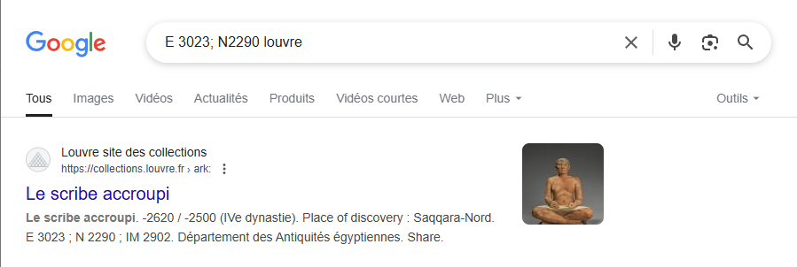
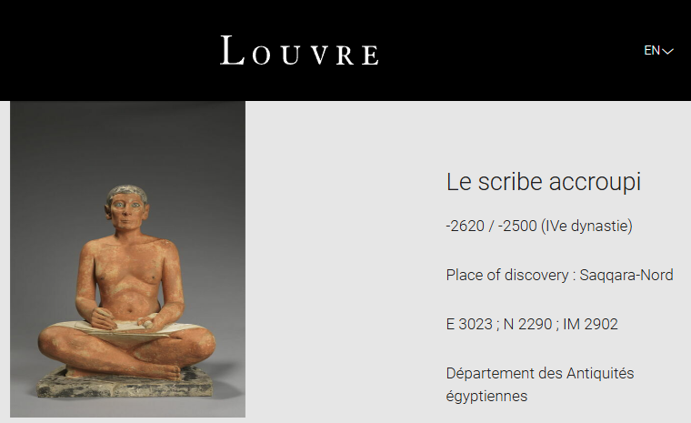

# DVCTF2025 - OSINT : C - Coordinates ? 

- Write-Up Author:  [Atlas](https://github.com/Atlas002) - [Les Seconds Choix](https://dvc.tf/teams/34)

- All credits for the challenge go to [DaVinciCode](https://www.linkedin.com/company/davincicode/posts/?feedView=all)

Flag

DVCTF{Saqqara-Nord} 

## Challenge Description:
You have been found by the OCBC (Office central de lutte contre le trafic des biens culturels - Central Office for Combating Trafficking in Cultural Property). To guarantee your freedom, you must cooperate: if you manage to provide all the information relating to the investigation, no charges will be brought against you.

While one of the security guards was doing his rounds, he noticed a strange inscription on one of the walls of the Sully wing on level 1.

"E 3023; N2290" 

Find the place of origin to which the inscription refers.
 
The flag is in the form: DVCTF{Place-Of-Origin}.  

## Write up  

We start the challenge by Googling the inscriptions found by the guard, `E 3023; N2290 Louvre`, and we end up with this:

  

Following the link we found, we end up on [this page](https://collections.louvre.fr/en/ark:/53355/cl010006582):

We then look at the place of discovery and find our flag: **Saqqara-Nord**

## Results

The flag for this challenge ended up being: 

`DVCTF{Saqqara-Nord}`

Thank you for reading this far, again, huge props to [DaVinciCode](https://www.linkedin.com/company/davincicode/posts/?feedView=all) for coming up with this challenge.

Thank you to everyone who was on site, the vibes were incredible and we'll see you next year!
