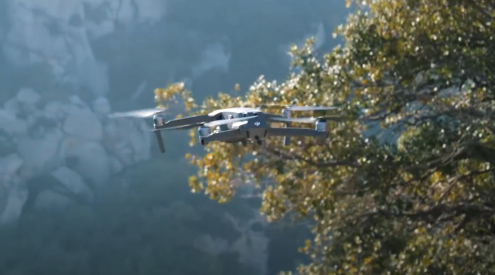
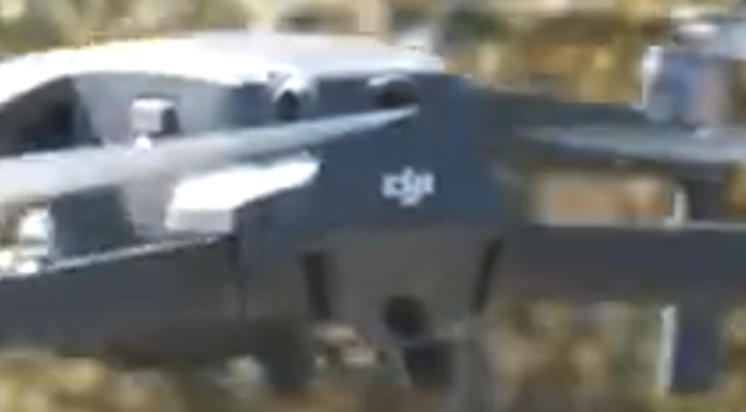

# ECW Qualifiers CTF 2025 - OSINT : DroneGuesser_I

- Write-Up Author:  [Atlas](https://github.com/Atlas002) 

- All credits for the challenge go to [Astek](https://astekgroup.fr/).

Flag

ECW{982815391_72_38_10000}

## Challenge Description:

You heard weird noises coming at high speeds from outside. Oh it's a drone!  

Get some general information about it and its producing company.  

- Siren number : xxxxxxxxx  
- Max speed : yy km/h  
- Maximum wind resistance : zz km/h  
- Maximum theoretical range in the US : vvvvv m  

Replace the corresponding data in the flag to validate the challenge.  
ECW{xxxxxxxxx_yy_zz_vvvvv}

## Write up  

When zooming on the logo we can see on that drone, we can clearly read "DJI", as in the well-known drone brand. 

With this information a quick search on [Pappers](https://www.pappers.fr/entreprise/dji-europe-bv-982815391) gives us the first part of the flag, the SIREN number : **`982815391`**  

Then, based on the form of the drone's fuselage and its camera, we can deduce that the one we can see in the video is a [Mavic 2 pro](chrome-extension://efaidnbmnnnibpcajpcglclefindmkaj/https://dl.djicdn.com/downloads/Mavic_2/Mavic+2+Pro+Zoom+User+Manual+V1.4.pdf) , which gives us the rest of the flag : 

- Max speed : ``72`` hm/h
- Maximum wind resistance : ``38`` km/h
- Maximum theoretical range in the US : 10 km -> ``10000`` m 

## Results

`ECW{982815391_72_38_10000}`

 