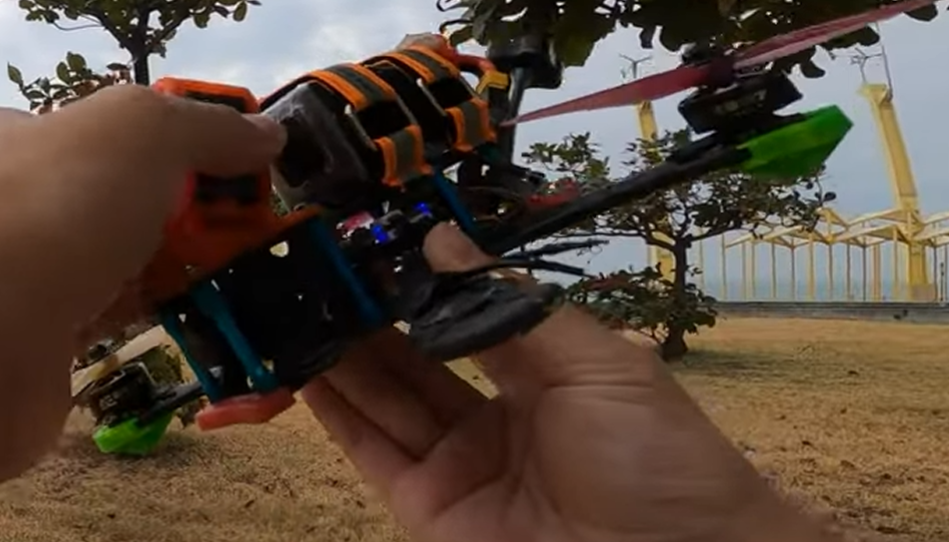
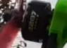
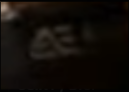
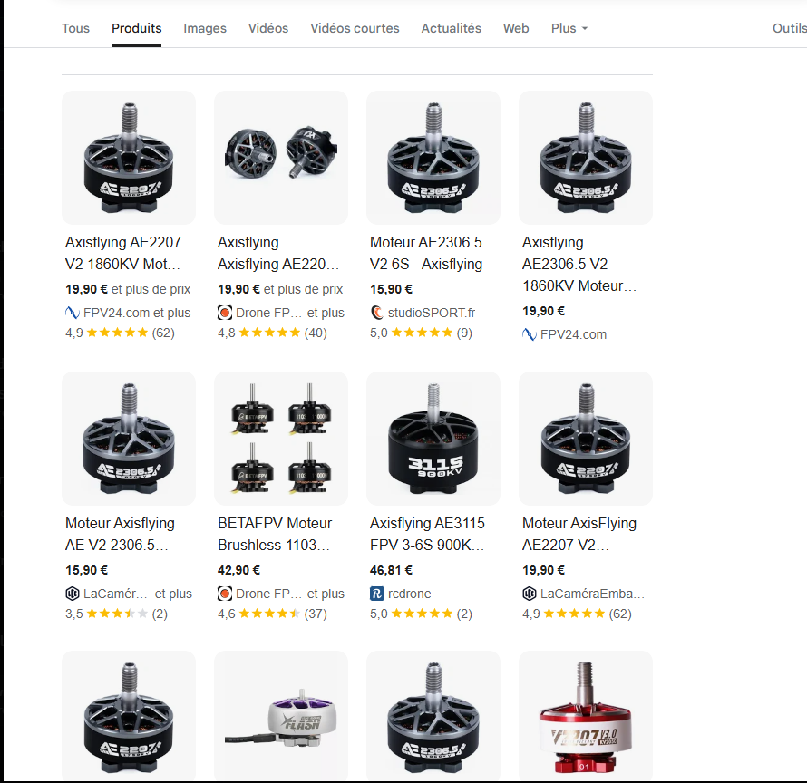
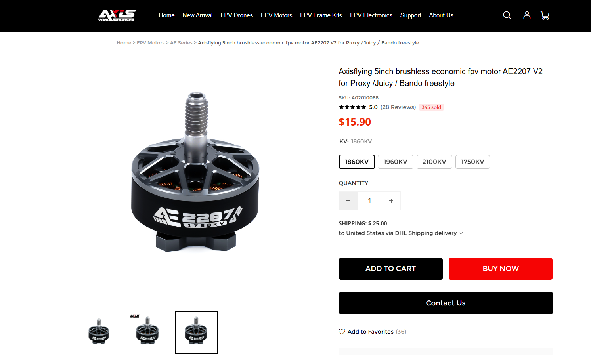
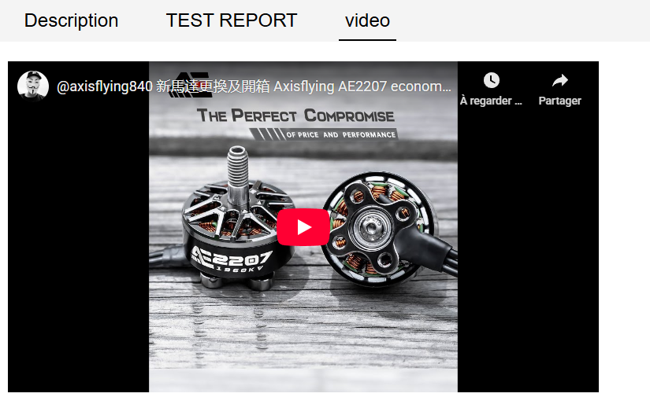
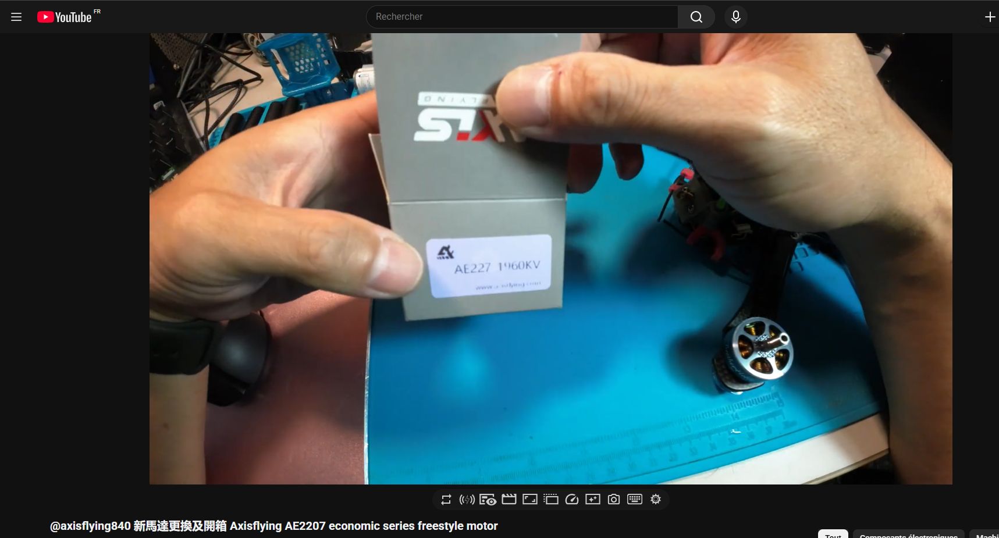
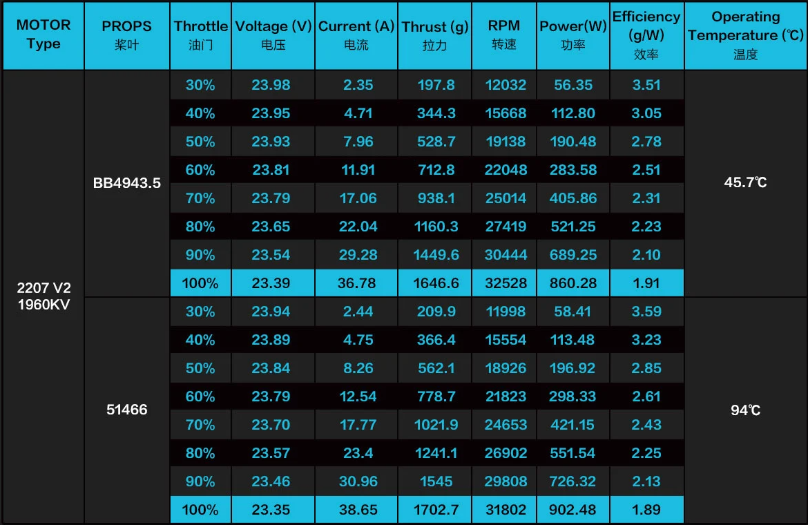

# ECW Qualifiers CTF 2025 - OSINT : DroneGuesser_II

- Write-Up Author:  [Atlas](https://github.com/Atlas002) 

- All credits for the challenge go to [Astek](https://astekgroup.fr/).

Flag

ECW{2207V21960KV_1702.7_31802}

## Challenge Description:

Your friend crashed his FPV drone and lost a motor a while ago !  

Let's offer him a replacement for the mesmerizing content he produces.  
Attached is his profile picture.  

Find the reference and official technical specs of his lost motor.  

ECW{MOTORType_MaxThrust_MaxThrustRPM}.  

*Take the values from the testing data*  

Flag format:   
`ECW{************_****.**_*****}`  

## Write up  

We first reverse image search the profile pitcure to find his socials, and we end up on his [youtube channel](https://www.youtube.com/@波風水門) : 

We can see that his channel is centered around FPV drones. Looking through his videos, we can see one titled **`我的馬達咧？I lost my motor!!`**  

 

The crash happens at around [5:48](https://youtu.be/6UsdBrO9ATc?si=5VYh5f0VpjD3RCpn&t=348), and afterwards we can see closeups of the drone model :  

Looking at some shots where we can get a better look at the motors, we can see some interesting informations: 

- We can read the number "2207" on one face  

  

- We can also kind of decypher the letters "AE" on another  

  

We then search for ``"AE 2207 FPV motor"`` and we end up with this : 

We then know that it's most likely a motor from the brand "Axisflying" from their 2207 V2 line.  

Going over to the brand's [website](https://www.axisflying.com/products/axisflying-5inch-brushless-economic-fpv-motor-ae2207-v2-for-proxy-juicy-bando-freestyle?VariantsId=10278), we can see that they have different variations for the same motor :  

Looking just a bit below in the "review" part of the page, we can see a face we should recognise :  

Watching the first few moments of the video, we can see the precise model of the motor he's going to install on his drone : 

We now know the precise make of the motor : `AxisFlying 2207 V2 1960KV`  
We're now trying to find the necessary documentation to find out it's max thrust and the the rpm for max thrust. 

Going over to the "Test report" part of the page, we can see the model's spec sheet : 

With that, we can now get the information we were missing :

- Max Thrust : `1702.7` g
- RPM for Max Thrust : `31802` 

With that and the correct make spelling from the spec sheet, we then get our flag : ``2207V21960KV_1702.7_31802``  

## Results

`ECW{2207V21960KV_1702.7_31802}`

 