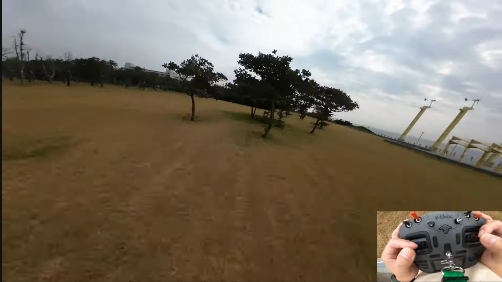
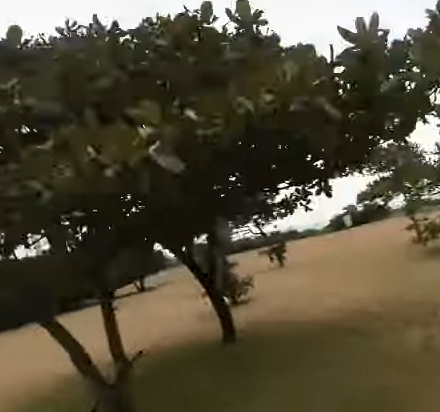
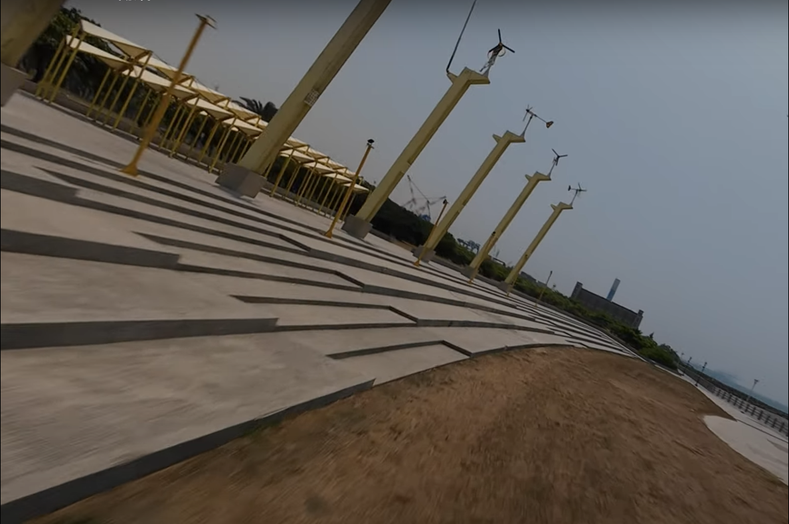
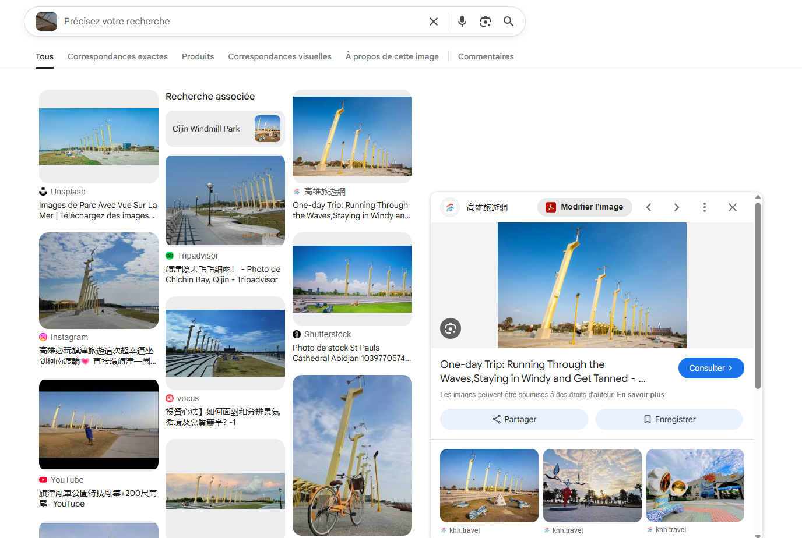
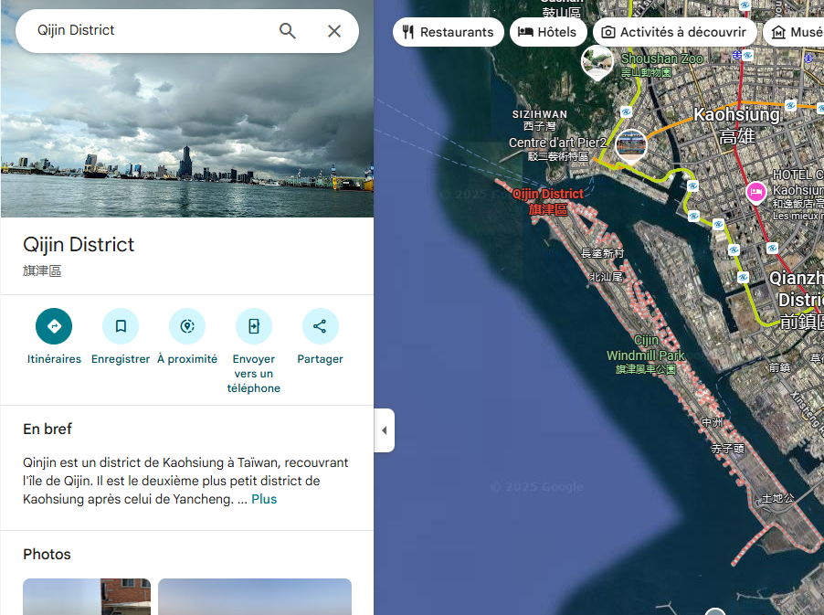
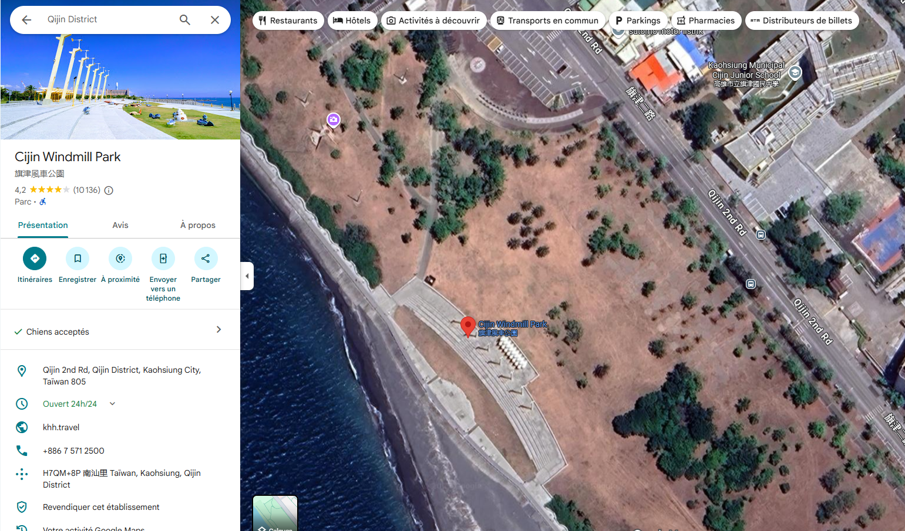
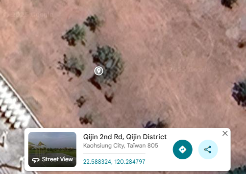

# ECW Qualifiers CTF 2025 - OSINT : DroneGuesser_III

- Write-Up Author:  [Atlas](https://github.com/Atlas002) 

- All credits for the challenge go to [Astek](https://astekgroup.fr/).

Flag

ECW{22.588, 120.285}

## Challenge Description:

Who put a tree here ?!  

Your friend caught on video a crash of his FPV drone into a tree a while ago, that time, he even left a motor on the floor !  

Find the exact coordinates of the tree he crashed into and lost a motor.  

Attached is his profile picture.  

Flag is the coordinates rounded to 3 decimal places. ``ECW{**.***, ***.***}``  

## Write up  

We first reverse image search the profile pitcure to find his socials, and we end up on his [youtube channel](https://www.youtube.com/@波風水門) : 

We can see that his channel is centered around FPV drones. Looking through his videos, we can see one titled **`我的馬達咧？I lost my motor!!`**  

 

The crash happens at around [5:48](https://youtu.be/6UsdBrO9ATc?si=5VYh5f0VpjD3RCpn&t=348) in these trees :

More specifically in this one : 

We then try to find out the location of the flying zone by reverse image searching some unique-looking part of the background.  
We get a hit when trying to do that with the yellow pillars near the coast : 

Following the first link leads us to a touring website of the area : 

We then learn that these are located in the `Qijin` district in `Taiwan`. 

Since the area is quite small, we begin to look for the row of pillars along the coast in satellite view, on which we end up rather quickly in the [`Qijin Windmill Park`](https://maps.app.goo.gl/2HzZqzrxQ3HaNGj76): 

We can then recognise the same cluster of trees as we saw from the video, and we know that he crashed into the ones that were the closests to the windmill park : 

Dropping a pin in the vincinity of the tree where the drone crash gives us these coordinates : `22.588324, 120.284797`  
Which **rounded up** to the 3rd decimal gives us : `22.588, 120.285`

## Results

`ECW{22.588, 120.285}`

 