# ECW Qualifiers CTF 2025 - OSINT : Jobstacle_II

- Write-Up Author:  [Atlas](https://github.com/Atlas002) 

- All credits for the challenge go to [Astek](https://astekgroup.fr/).

<details>
<summary>Flag</summary>
ECW{125.10.35.2_Victoire_Lanctot}
</details>

## Challenge Description:

Intel has given us info that the attackers have hidden their main C2 IP address bytes in different sources and location. Luckily, some of our brokers were able to obtain a telegram contact, which we suspect is part of their team, or at least was in the past. He's primordial help in finding our prime suspect too. They may know a thing or two ; engage in friendly dialog and find out what they have.

Find them here using the telegram app : t.me/ecwCryptoBot  
Send the IP and full name you find to the bot to validate !  
The flag format is ECW{xxx.xx.xx.x_Hugo_Baguette}  


## Write up  

### Part 1 - IP address

When connecting to the telegram bot, we're first greeted with this message : 

```
First, I need you to find the IP address of the suspect. When I was working with the crew, John often told us that he went to explore the departmental archives in his free time.
He left from our hideout near the Ibn Khaldoun mosque, and went northwest to the archives. I think he also always stopped to different pharmacies (for better OPSEC, we think) on the way back but only right after getting cash from a closeby bank.
He needed the stuff for his diabetes I think. Anyway, he left me a notebook with some weird poems ? You might make something of it, here's a transcript.

1 - August 2023 :
Near the road's mount, a tryptich of arrows
One of them on top. Its number will be your first vow.

2 - ebruary 2025 :
At the old bourgeois boulevard lies another clue,
But watch the temperature ! It might get frezeing for you.

3 - [erased] 2023
In a bustling town, where technology is king,
There lies a small shop, for those who need fixing.
Their name has put many at ease.

4 - march 2022
Step into the realm of melodies and scenes,
Where vinyls, CDs, and DVDs reign serene.
A shop with a yellow storefront will be your guide,
The truth lies somewhere inside.

Don't forget meds !!!! 4 pharmas are clean
200, 48.12939945601638, -1.6943130170587877, 48.093306482270535, -1.6520208744113876

Don't forget to feed Rosco
```

We then know that we need to find 4 pharmacies near the Ibn Khaloud mosque.  
We first look up the mosque on maps to find that it's located in Rennes, France :   

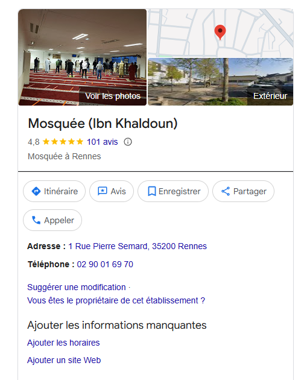

The first pair of coords we were given at the end of the message into maps most probably hints at the location of their hideout :  

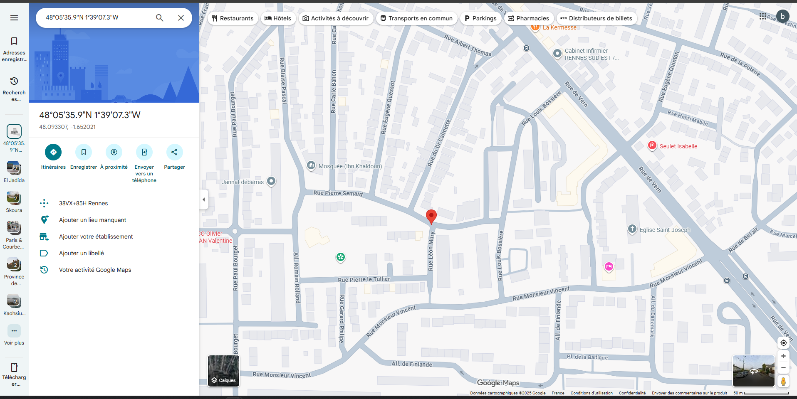

The second pair of coords we were given lead to the `Archives Déparementales d'Ille-et-Vilaine` :  

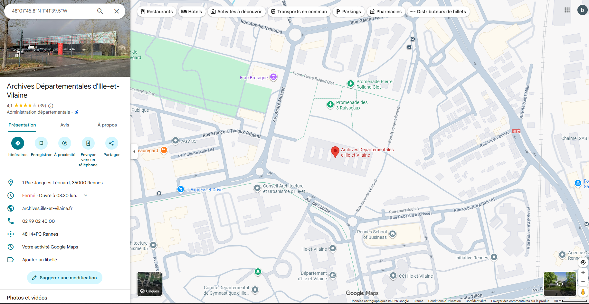

We can then narrow down our searches to pharmacies inbetween those two points.  

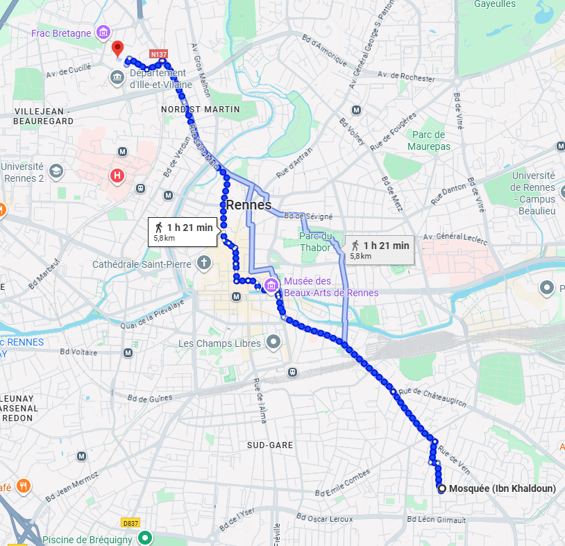

Since we have four parts to the poem and need to find a complete ip adress, chances are we need to either find or deduce a number for each paragraph.  

First one is dated to August 2023, and looking into street view coverage we learned that there was only a few parts of the city were shot in 2023.  
From all the pharmacies in the vincity of the two points we covered earlier, only this one was covered by street view in 2023 :   

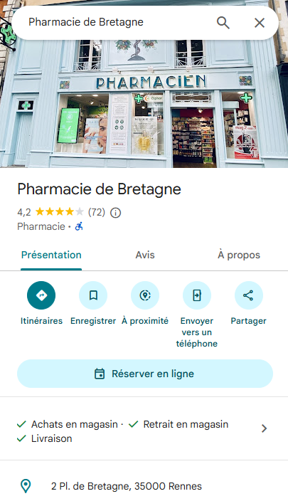

Following the 2023 coverage on street view, we come accross this :  

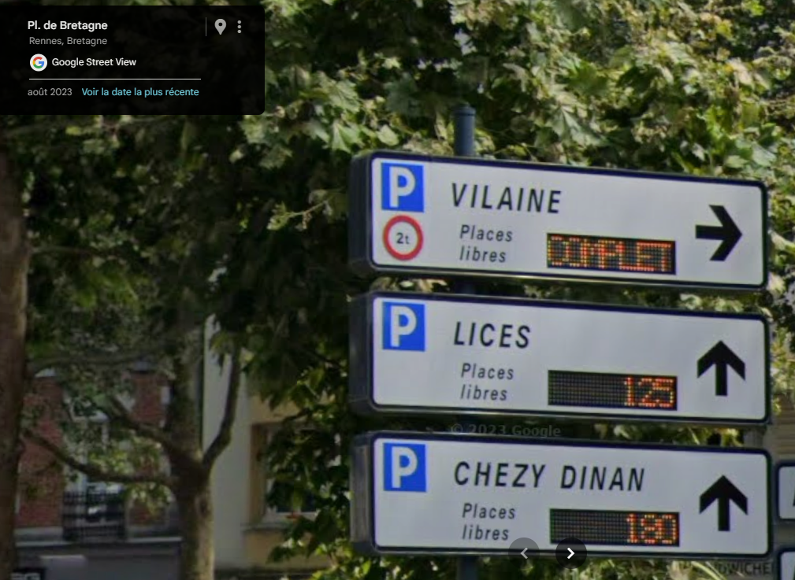

The text mentionned a "tryptich of arrows" and a "number on top".     
We then have our first number : **`125`**  


The second one is dated to [F]ebruary 2025, mentions an "old bourgeois boulevard" and freezing temperatures.  
Looking "old bourgeois boulevard rennes pharmacie" on google yields us this  :  

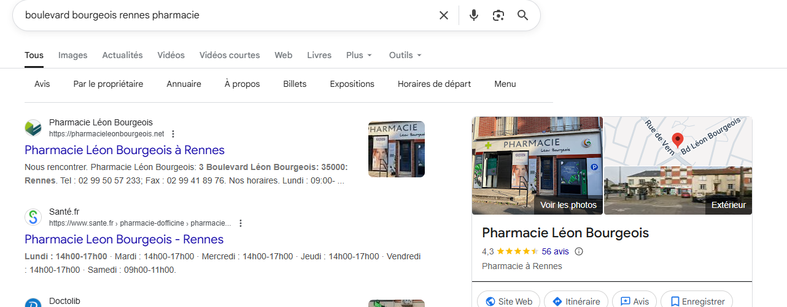

"Pharmacie Léon Bourgeois", on the Léon Bourgeois boulevard. 

Going on streetview, we also see that it has a coverage dating back to february 2025. We then look for a shot where their outside sign shows the temp :

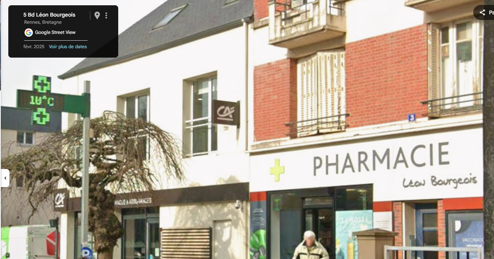

We then get our second number : **`10`**

The third one is dated only at 2023 and talks about a tech repair shop, while mentioning something in their name.  
From that we can assume we need to search a repair shop with an "unusual" name and that was covered in 2023. 

One of the fitting shops was this one : Mobile35, covered in april 2023

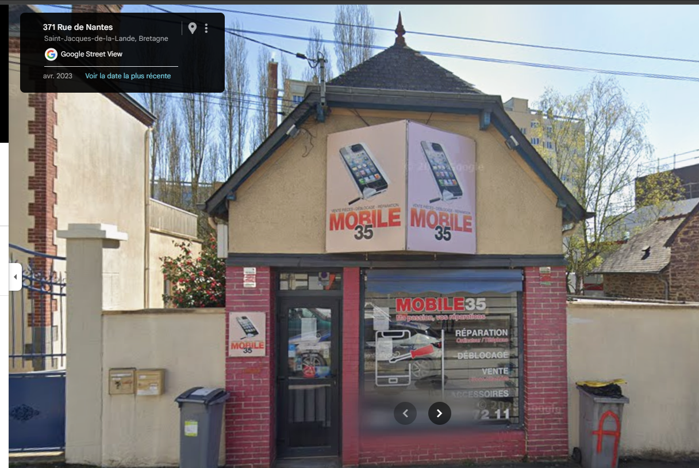

We then get our third number : **`35`**

> [!NOTE]  
> Apparently this wasn't the intended solve for this paragraph, as the correct reference was "PC35" near another pharmacie,
> but since the numbers are the same this wasn't an issue for the rest of the challenge.

The fourth and last part is dated to march 2022 and mentions a CD/Vinyl shop with a yellow storefront, and the last number to be "somewhere inside".

Going over all the Vinyl shops in the target zone, the only one with a yellow storefront was this one : O'CD

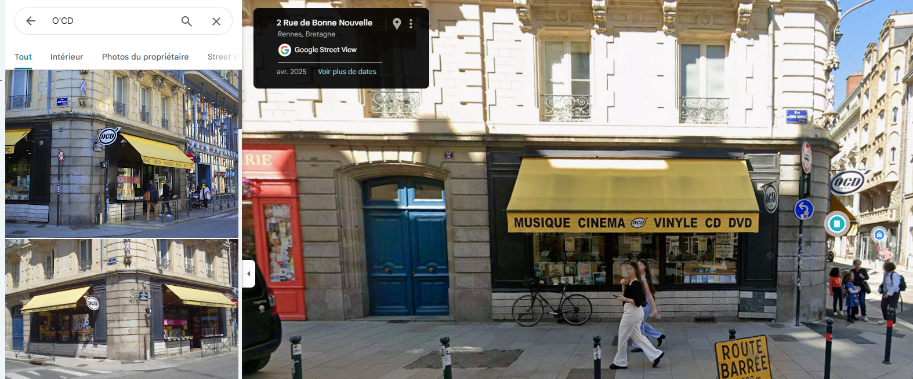

Going to the march 2022 streetview for the place, we do notice something in the storefront : 

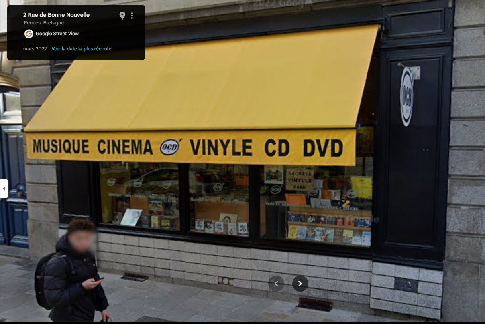

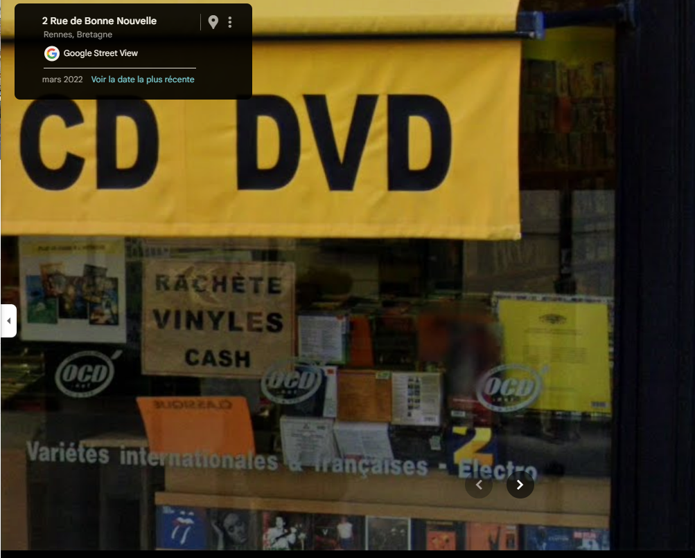

We then get our last number : **`2`**

We then have our completed IP address : **`125.10.35.2`**

--- 
### Part 2 - Person of Interest

After sending the correct IP address, the telegram bot replies with this : 

```
Great! Now, I need you to find the name of one of their contacts. They are a key asset in the operation but we dont have much information on them : the only thing we know is that they are linked to a guy named Julien Martinano. This guy has a pretty sparse online presence, on few platforms. One of our interns found he has an Instagram but lost the link (ugh). Maybe they are childhood friends of sorts from the Lycée Saint Martin in rennes, but we're not sure. They seemed to be pretty close - try to find the contact's full name.
```

With that we learn that we have to find someone that was friends with a certain "Julien Martinano", which has a sparse online presence and an instagram account we don't have the link to. We also know that he potentially went to "Lycée Saint Martin" in Rennes. 

Our first step will to google "Lycée Saint Martin Rennes" and end up on [this page](https://www.instagram.com/stmartin_rennes?igsh=cnMwMXEyNWR5NDY4). 

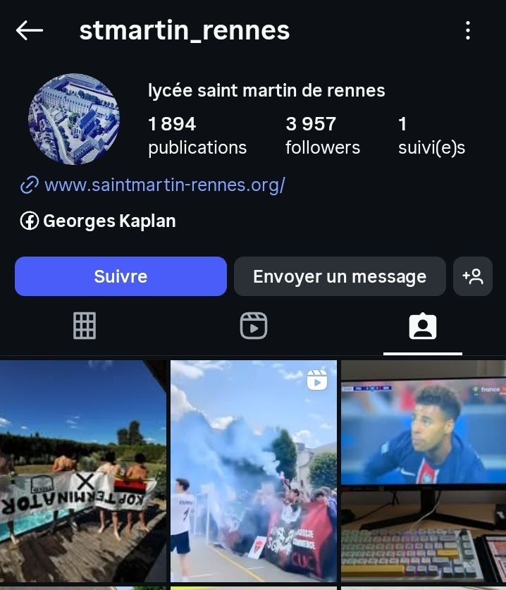

Looking at the posts they're tagged on, we can see that one was posted by a [@theskyisfalling48]()

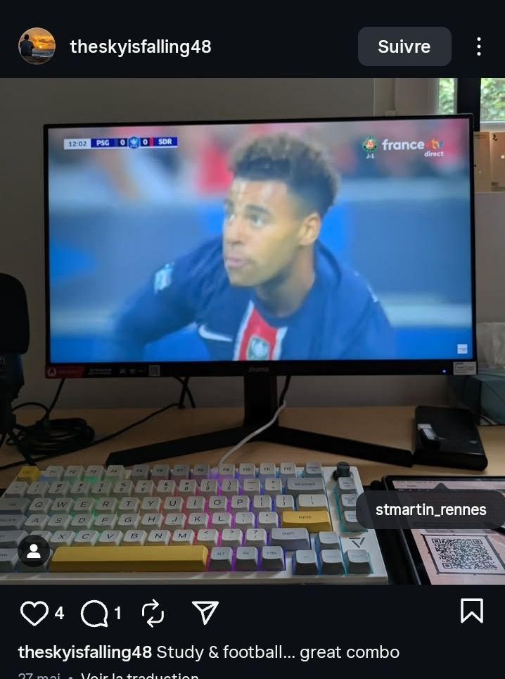

Going over to the account that posted this, we can see that it refers to a "J Martinan0", most likely the Julien Martinano we're looking for :

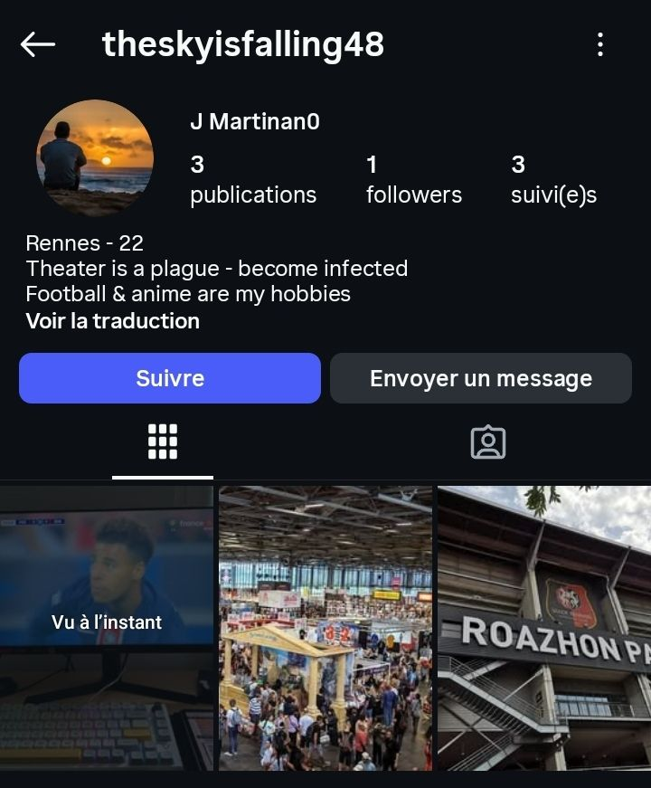

Now that we know we're on the right account, we go back to that first post to notice two interesting things : 

- A QR code in the lower right corner of the picture

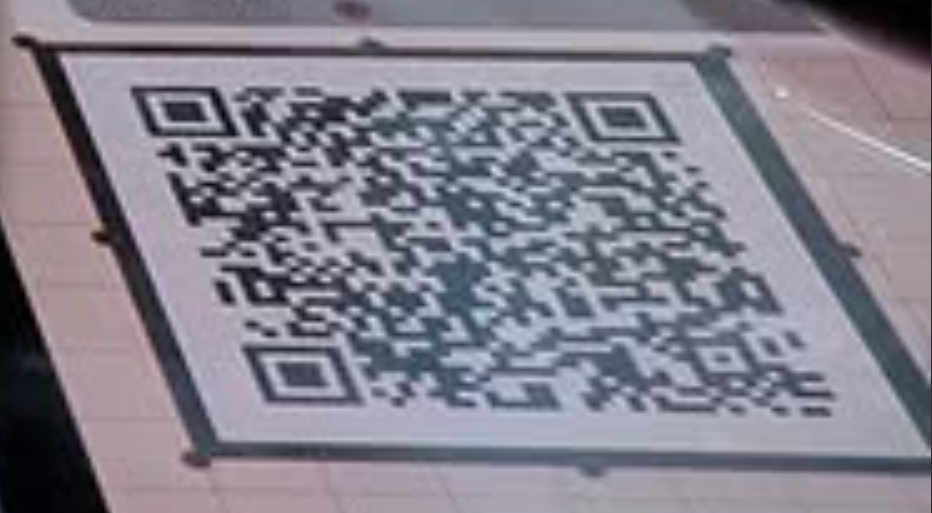


- A comment partially encoded using base64

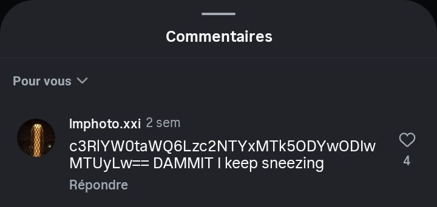


When first scanning that QR code, we're sent on a [cat video]() with no apparent ties to the challenge : 

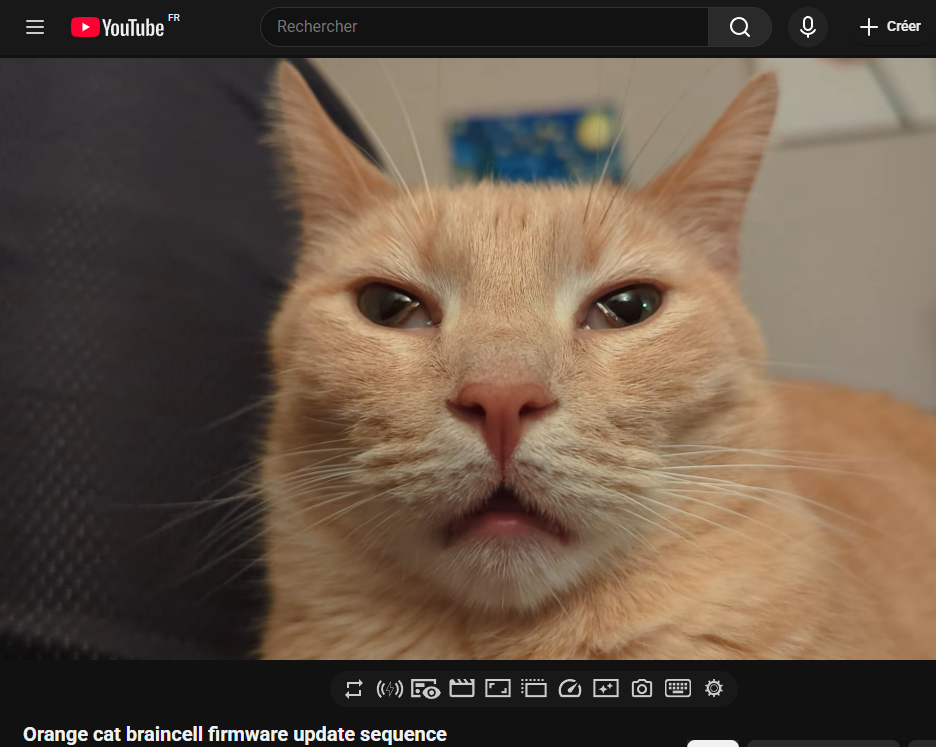

However, when deconstructing the QR code with a dedicated app, we can see that a message was hidden in it's code : 

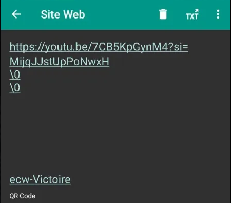

We then see our first piece of information : **`ecw-Victoire`**


Going back to the comment, we see that it has a base64 encoded string : `c3RlYW0taWQ6Lzc2NTYxMTk5ODYwODIwMTUyLw==` 

We then decode it using [Cyberchef](https://gchq.github.io/CyberChef/#recipe=From_Base64('A-Za-z0-9%2B/%3D',true,false)&input=YzNSbFlXMHRhV1E2THpjMk5UWXhNVGs1T0RZd09ESXdNVFV5THc9PQ&oeol=CR) :

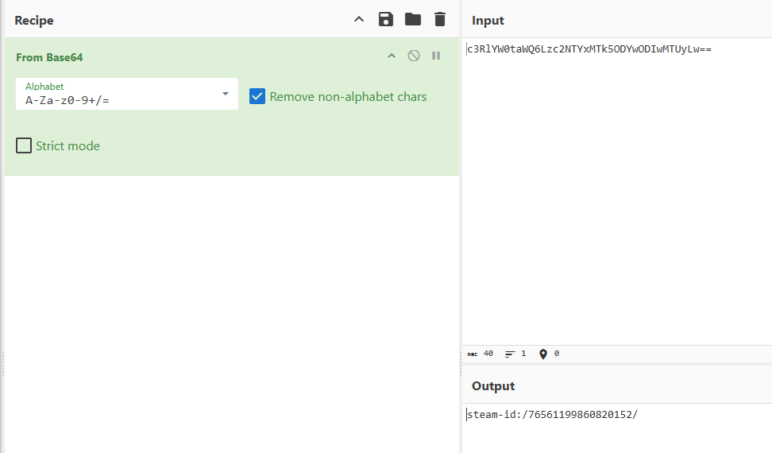

This then gives us a Steam ID : `76561199860820152`.

We then go over a Steam ID Lookup Website to find the account it refers to :

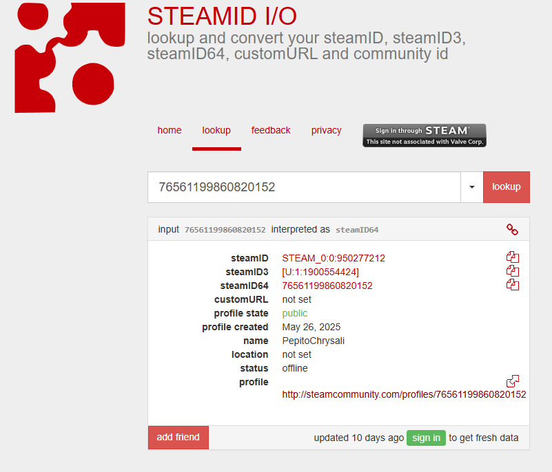

We then see that the account is named 'PepitoChrysali'

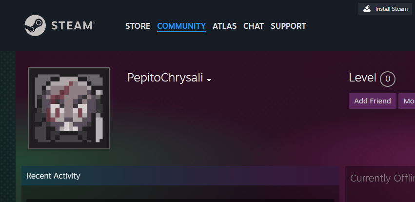

However, when looking at the user's previous nicknames, we see one pop up : **`ecw-Lanctot`**

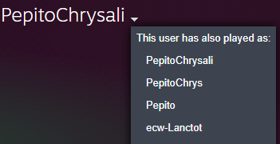

This then gives us the full name we were looking for : **`Victoire Lanctot`**

We then send it to the telegram bot for confirmation : 

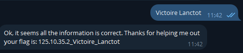

And we then have our flag body : `125.10.35.2_Victoire_Lanctot`

## Results

`ECW{125.10.35.2_Victoire_Lanctot}`

 