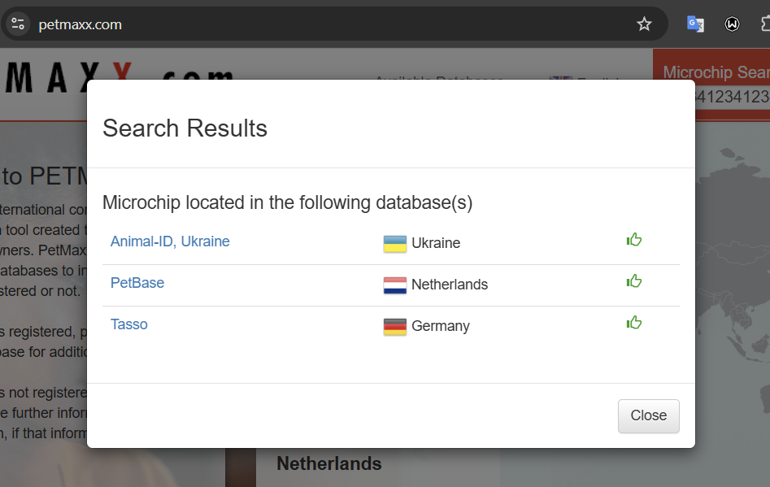
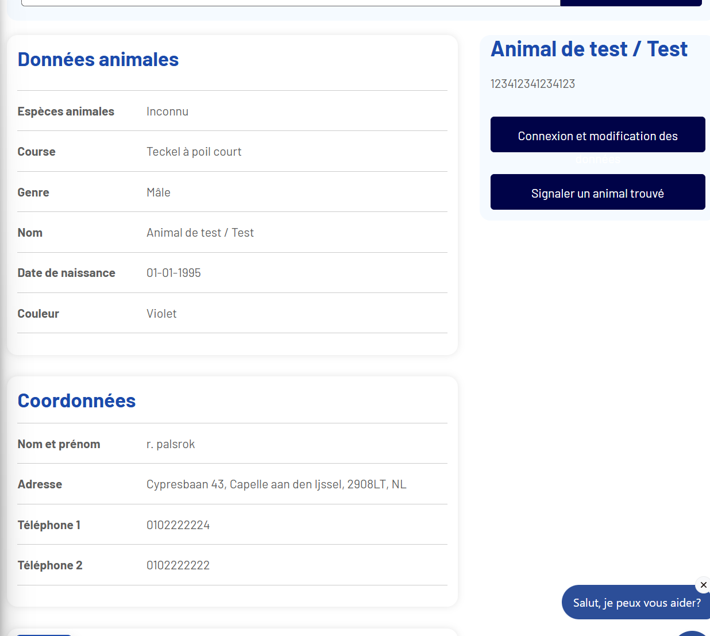
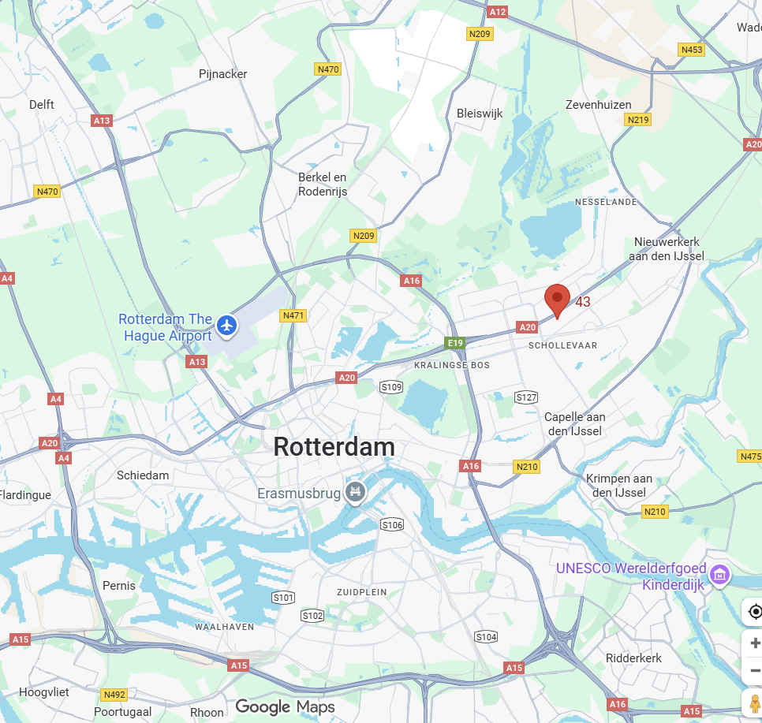
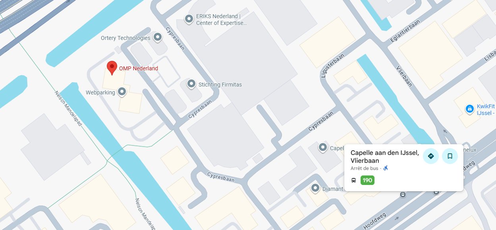

# ECW Qualifiers CTF 2025 - OSINT : Larry's enigmas

* Write-Up Author: [Atlas](https://github.com/Atlas002)
* All credits for the challenge go to [Astek](https://astekgroup.fr/).

<details>

<summary>Flag</summary>

ECW{Rotterdam\_190\_Vlierbaan}

</details>

## Challenge Description:

Larry wants to meet up. The place is secret of course.

Larry doesn't believe in cryptography... so he ends up using non-traditional (straight up annoying) methods of sharing his position.

This time, he seems to be using a pet biochip as a beacon.

Find the nearest bus stop from his position.

Format : ECW{City\_n°bus\_BusStopName}. Example : ECW{Tbilisi\_316\_FreedomSquare}

.png>)

```
My friend,

I have to keep my location secret.
Hence, I won't give you my location in clear.
Cypher algorythms could be cracked by the quantum or something 
(I fear because I do not understand fully)

I am sure you, out of everybody, will be able to understand me.

I currently live with the dog.

We have a lot to discuss in person.
Sincerely yours,
See you soon,
Larry
```

## Write up

Once again, just like the challenge [WhosDatCat](../Whosdatcat/), we're tasked with finding coordinates with only a pet id being given to us.

This time around the ID is `123412341234123`

We use [PetMaxx](https://www.petmaxx.com/) to search international databases if they return a hit :



We see three hits :

* One in Ukraine
* One in Germany
* One in the Netherlands

Going over each three, we can see that two of those are cats (Ukraine and Germany) and only one is a dog (Netherlands).

Reading the message Larry sent, we can read `I currently live with the dog.`, so we assume that we should follow this lead.

Going over the Dutch website, we find this for the ID we look up :



Great! We now have an address to look up on maps : Cypresbaan 43, Capelle aan den Ijssel, 2908LT, NL



We now have our first piece of the flag : `Rotterdam`

Now we look for a bus stop in the vicinity of the adress we got and we find this :



We then get our last two pieces of information : `bus 190, stop Vlierbaan`

## Results

`ECW{Rotterdam_190_Vlierbaan}`
