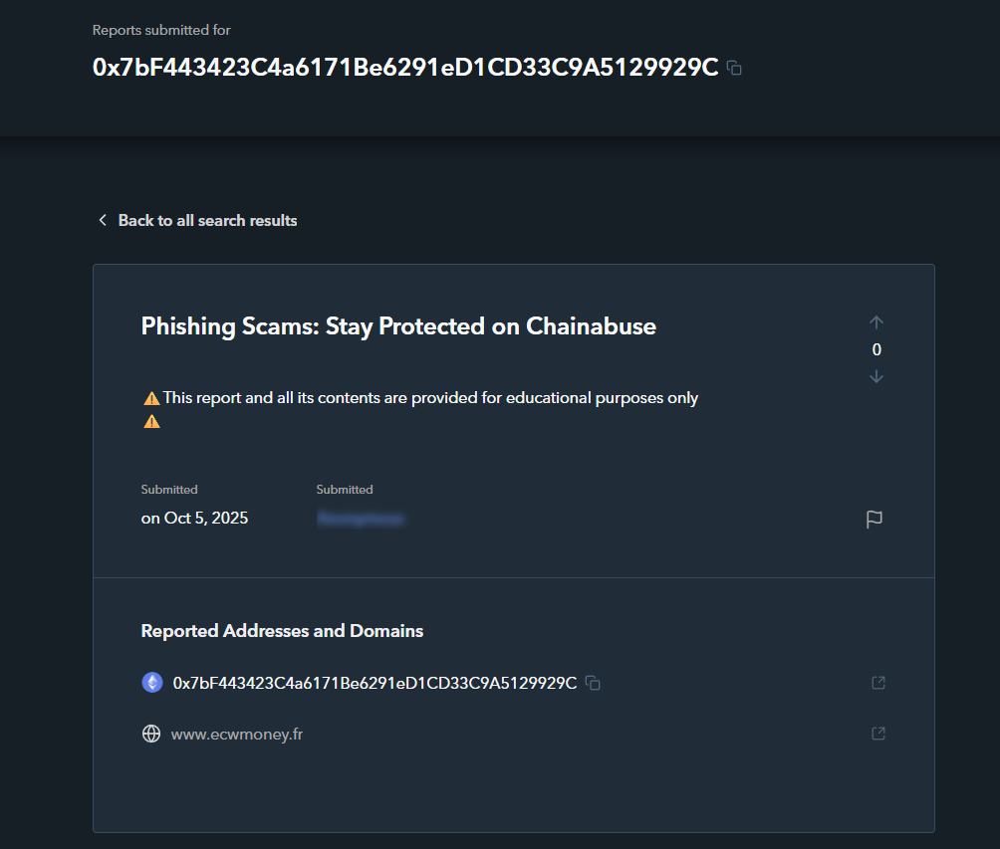
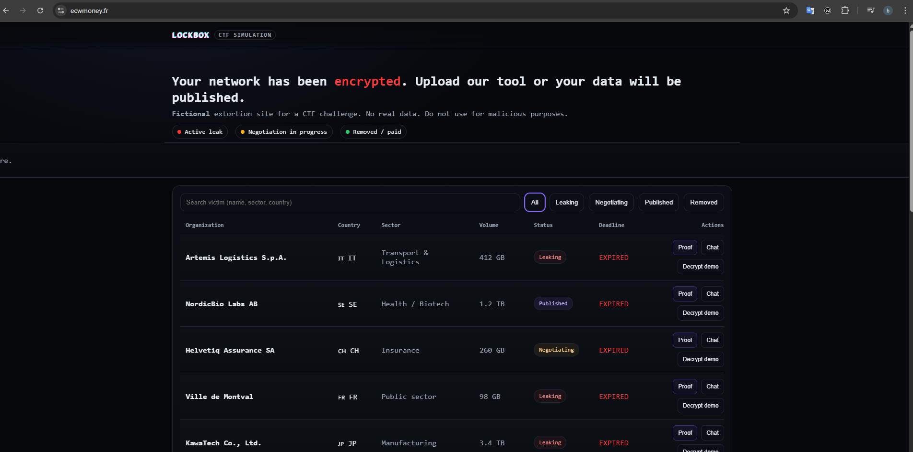
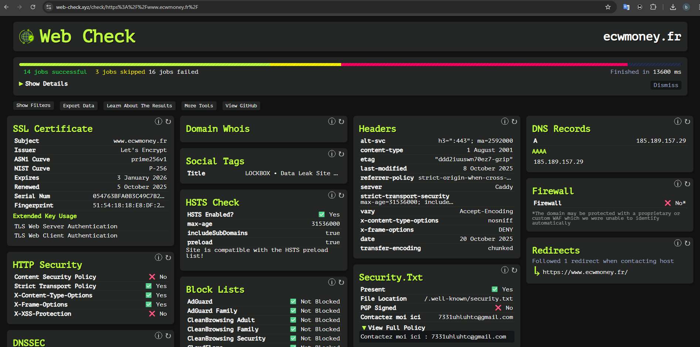
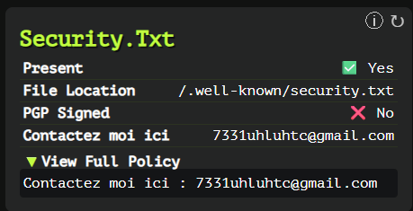
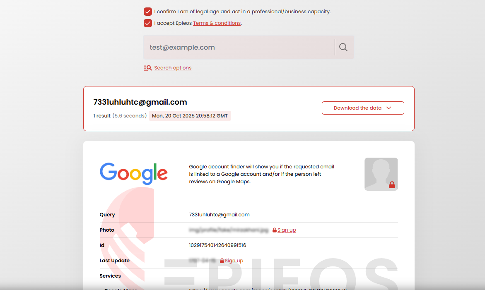
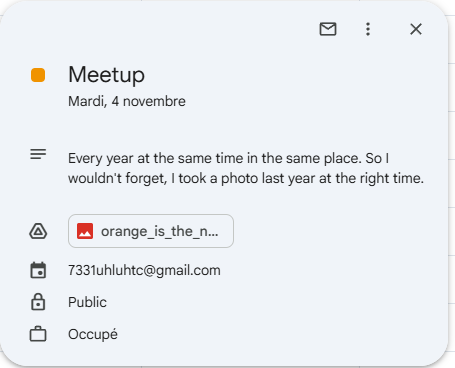
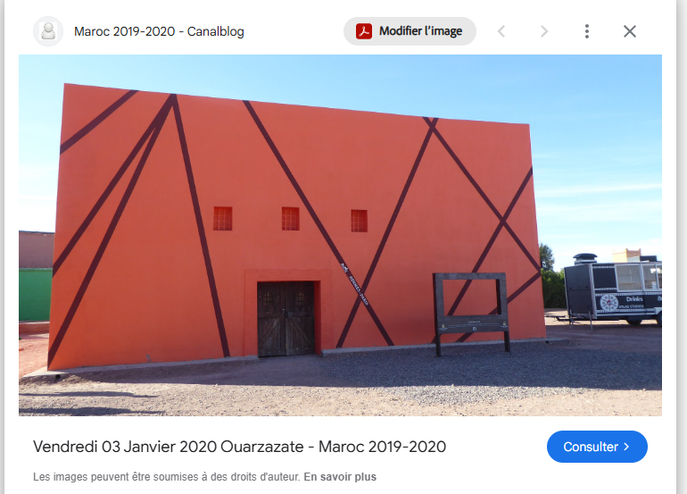

# ECW Qualifiers CTF 2025 - OSINT : Operate Behind the Scenes

* Write-Up Author: [Atlas](https://github.com/Atlas002)
* All credits for the challenge go to [DGA - Direction Générale de l'Armement](https://www.defense.gouv.fr/dga).

<details>

<summary>Flag</summary>

ECW{Ouarzazate:04:11:2025:18}

</details>

## Challenge Description:

I think he's spotted us: he's encrypted our PC and is demanding a transfer to the following address: 0x7bF443423C4a6171Be6291eD1CD33C9A5129929C

We are counting on your advanced skills: tell us in which city to find him, on what day and at what hour.

Flag format: ECW{City:DD:MM:YYYY:HH}

## Write up

We now need to get coordinates from a crypto address.

We first look up the address on etherscan to see if we have anything, but it doesn't have any meaningfull transaction yet.

From the context, we're being told that the person we're tracking down has "encrypted our PC" and is demanding money via a crypto adress, which is typicall of ransomware actors. With that in mind, we go over [chain-abuse](https://chainabuse.com/report/45064704-0944-417e-886e-87df58b472c5?context=search-address\&a=0x7bF443423C4a6171Be6291eD1CD33C9A5129929C\&chain=) to see if that wallet has been flagged in the past, and sure enough we get a hit :



In the report we can see that it mentions a website : [www.ecwmoney.fr](https://www.ecwmoney.fr/)

Going over to that website, we can see that it looks like a ransomware "dashboard", with a list of all compromised entities, with status regarding negociations and leaks :



We then put the url and domain name into [web-check.xyz](https://web-check.xyz/) to gather informations about the registrar and other possibly relevant stuff :



In that report we can see that we've found an email address in `/.well-known/security.txt` : `7331uhluhtc@gmail.com`



Putting the email we've found into [Epios](https://epieos.com/) gives us a hit



```json
{
  "metadata": {
    "query": "7331uhluhtc@gmail.com",
    "timestamp": "2025-10-20T20:58:12.296Z"
  },
  "data": {
    "visitor": {
      "google": {
        "id": "102917540142640991516",
        "services": {
          "google_maps": "https://www.google.com/maps/contrib/102917540142640991516",
          "google_calendar": "https://calendar.google.com/calendar/u/0/embed?src=7331uhluhtc@gmail.com",
          "google_plus_archive": "https://web.archive.org/web/*/plus.google.com/102917540142640991516*"
        }
      }
    }
  }
}
```

Following that google calendar link, we find an event store on the gmail account :


We now have a date : 04/11 .

With that calendar entry we also get a picture :



Reverse image searching hit gives us a hit in the studio atlas in Ouarzazate.



We now have the date and place, we just need to get the time.

Running an exiftool on the picture doesn't reveal anything, so we'll have to rely on "intuition".

Based on the shadow casted by the building, we can assume that the sun is pretty low in the sky, meaning it's either near sunrise or sunset. The picture being took in early november tells us that the sky rises late and sets early.

We then estimate the time to be either 6 AM or 6 PM, tries will reveal it's the later.

Ouarzazate:04:11:2025:18

## Results

`ECW{Ouarzazate:04:11:2025:18}`
