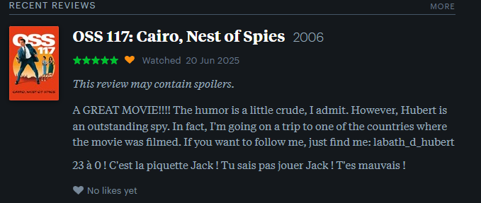
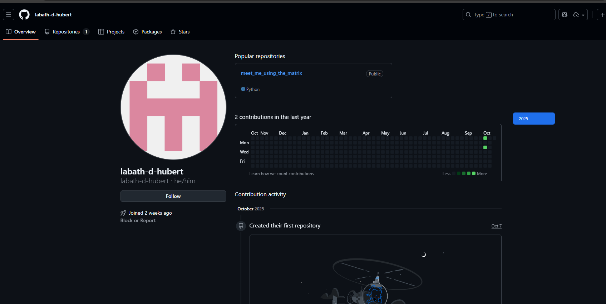
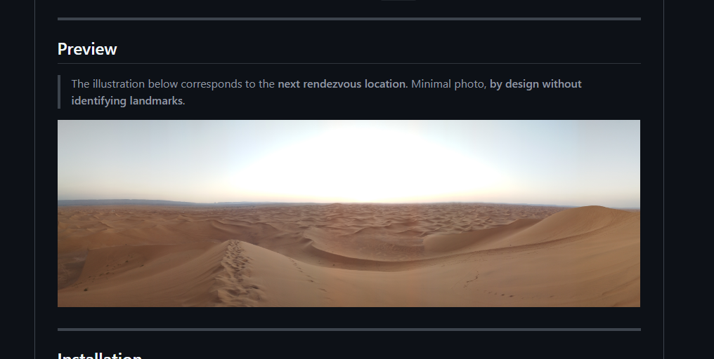
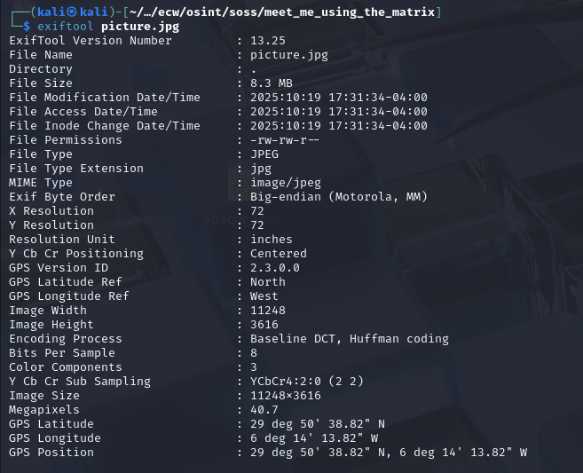
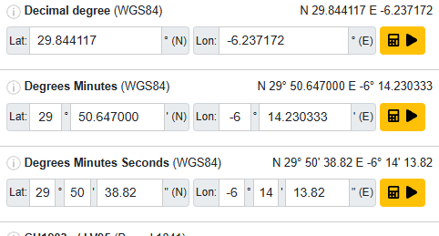

# ECW Qualifiers CTF 2025 - OSINT : SOSS

- Write-Up Author:  [Atlas](https://github.com/Atlas002) 

- All credits for the challenge go to [DGA - Direction Générale de l'Armement](https://www.defense.gouv.fr/dga).

Flag

ECW{29,844117° N 6,237172° W}

## Challenge Description:

We have obtained more information about this spy. He is a movie fan and his username is: ecwthief

Flag format:
ECW{12,789456° N 9,895623° W}

## Write up  

We now need to find GPS coordinates based on a username : ecwthief. 

We're told that he's a movie fan, so first instinct would be to check letterboxd, [which does not dissapoint](https://letterboxd.com/ecwthief/) : 

On his profile, we can see that he has three movie rviews, one which is for a movie linked to the name of the challenge : OSS 117: Cairo, Nest of Spies : 

In this review he tells us that he's planning on following the footsteps of his favorite actor and to "follow him" with this username : ``labath_d_hubert``

Looking up that new username, we first find an instagram account : [@labath_d_hubert](https://www.instagram.com/labath_d_hubert/?hl=en)

On that account, the description of it's most recent post catches our attention : 

It mentions finding a location using code someone gave him. We then google to see if his username would be linked to a github account or something similar, but no hit.

It's only when using other search engines (bing/edge in this case), that we see a github account pop up : [labath-d-hubert](https://github.com/labath-d-hubert)  

Going over to his account, we can see that he's got only one repo, [meet_me_using_the_matrix](), in which we can find a python scripts (which displays pretty characters matrix style and nothing else) and a picture : 

We then download the picture and run an `exiftool` on it :

Bingo, we get GPS coordinates that we just need to convert to the right format : 

29,844117° N 6,237172° W

## Results

`ECW{29,844117° N 6,237172° W}`

 