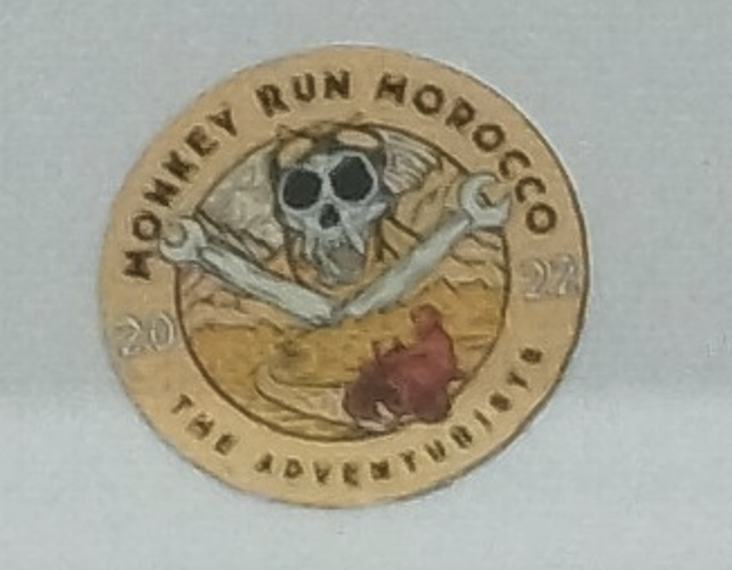
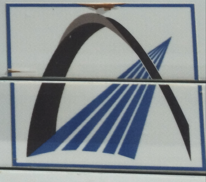
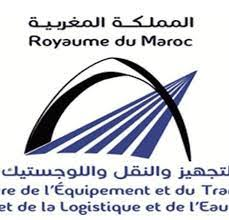
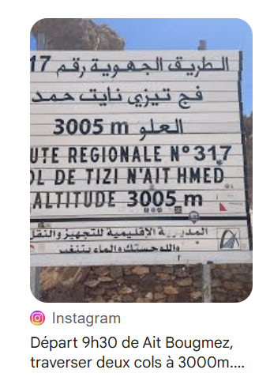
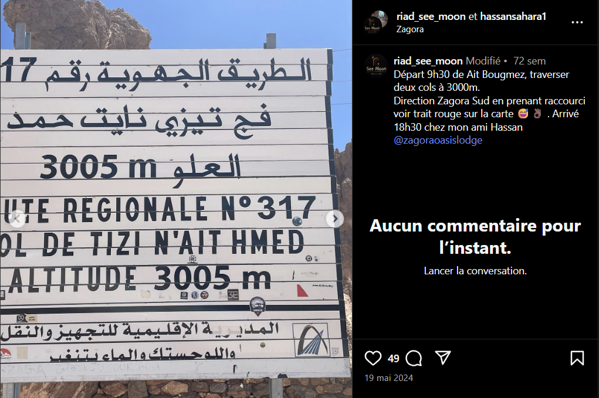
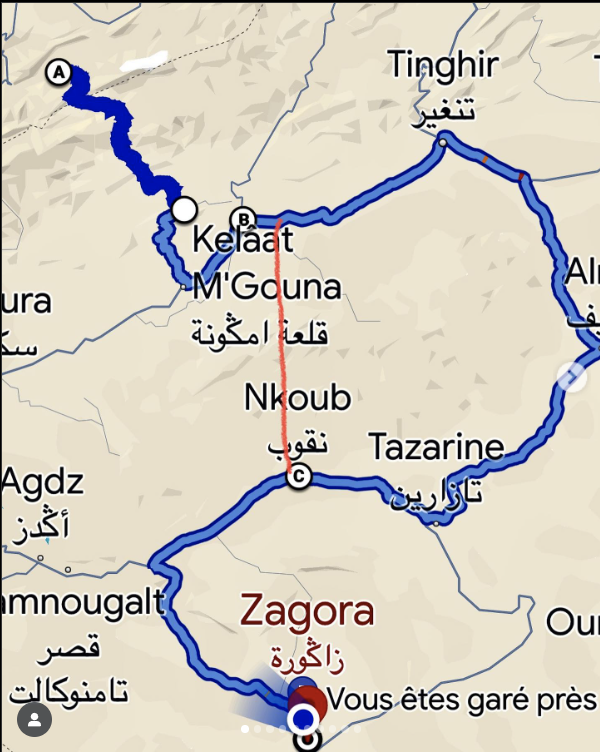
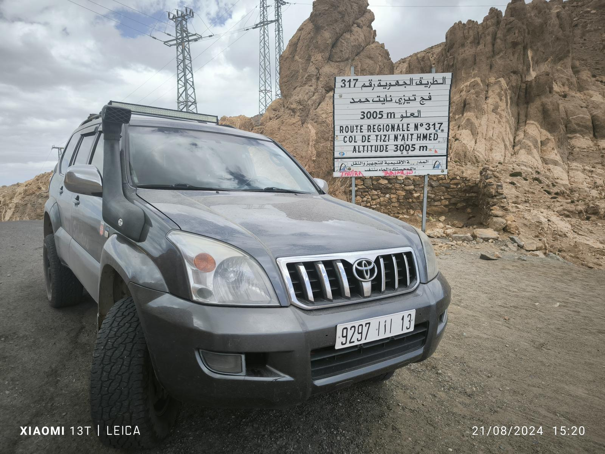
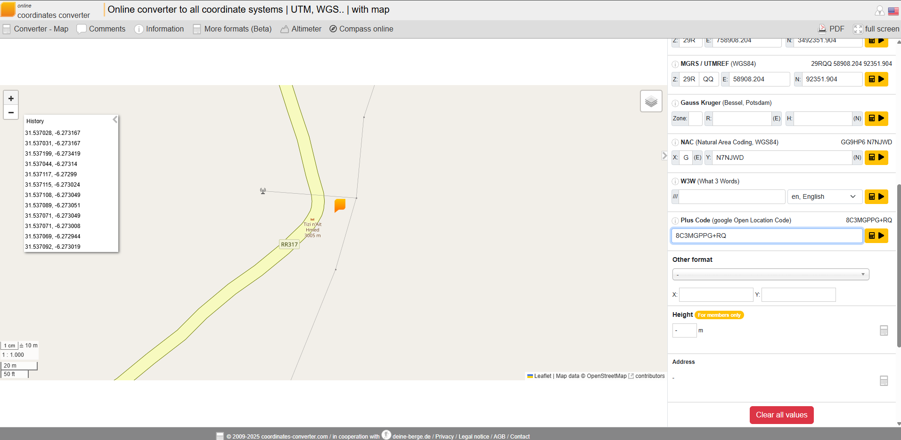

# ECW Qualifiers CTF 2025 - OSINT : It's a sign

- Write-Up Author:  [Atlas](https://github.com/Atlas002) 

- All credits for the challenge go to [DGA - Direction Générale de l'Armement](https://www.defense.gouv.fr/dga).

Flag

ECW{8C3MGPPG+RQ}

## Challenge Description:

We are on the trace of an enemy agent. He appears to have escaped to a country that does not seem to be France.

A photo has been leaked, locate it and give us its approximate location.

Flag format: ECW{8CWW4889+29}

## Write up  

We are tasked with finding the location of a sign from a closeup photo of it. 

First we try to look more closely to what on that sign, two sigils catch our eyes : 

- this sticker mentionning "Monkey Run Morocco", hinting that we may be in Morocco

- This logo, which when reverse image searched give us the logo of the ``Moroccan ministry of logistics ``

From these two pieces, we can now narrow down our searches to ``Morocco``.

Now reverse image searching the sign while refining with Morocco, we end up on this instagram post : 

We now learn that the sign is located on route 317, near zagora

Searching a bit more with the informations, we find this picture which tells us that the sign is at a road turn with powerlines nearby

With all of this, we can now pinpoint the signs location (bend in the road and powerlines on route 317) 

We now get the plus code of the sign's location : 8C3MGPPG+RQ

## Results

`ECW{8C3MGPPG+RQ}`

 