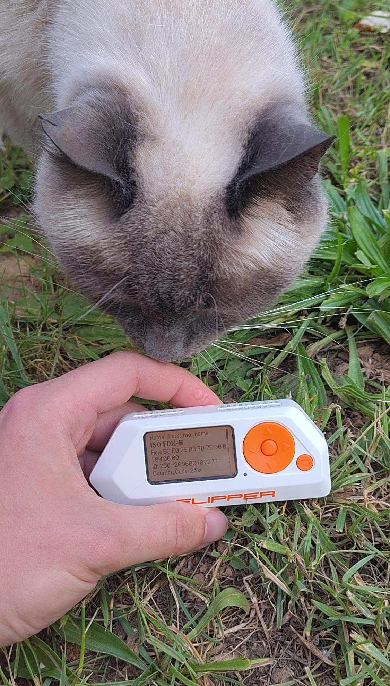
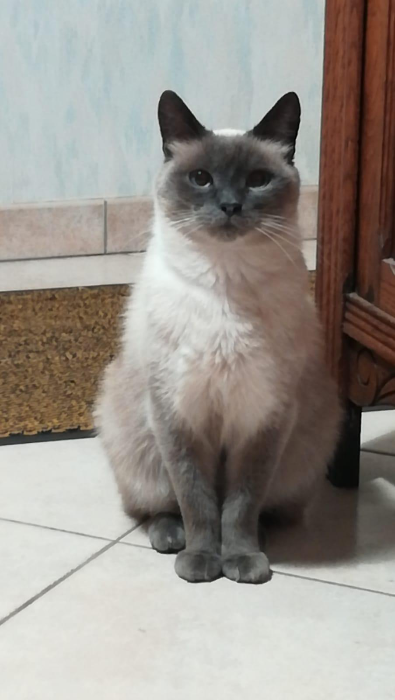
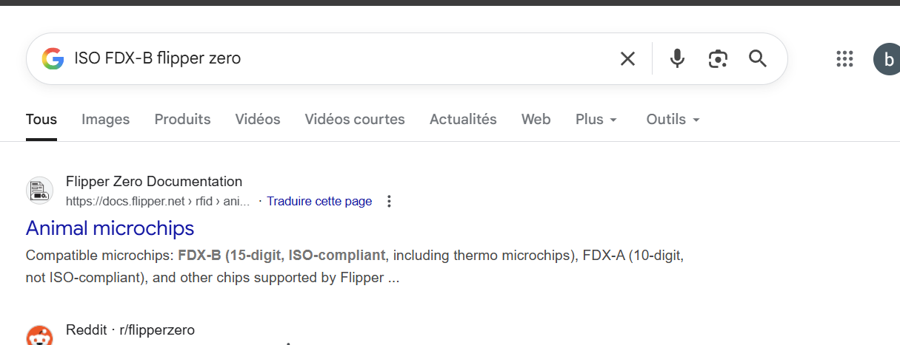
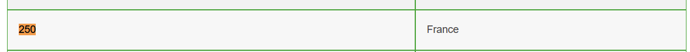
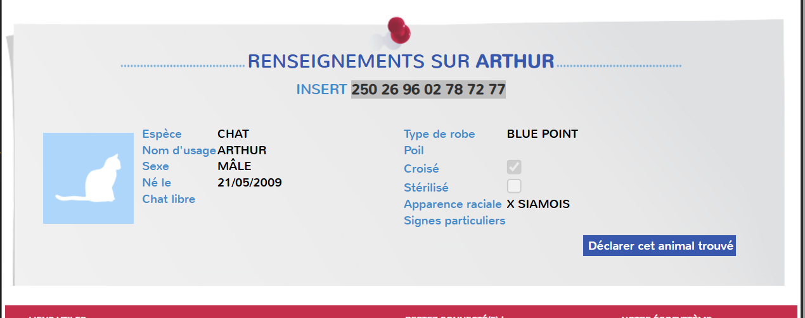

# ECW Qualifiers CTF 2025 - OSINT : Whosdatcat

* Write-Up Author: [Atlas](https://github.com/Atlas002)
* All credits for the challenge go to [Astek](https://astekgroup.fr/).

Flag

ECW{Arthur}

## Challenge Description:

What is my cats name ? Flag is simply "ECW{Name}"

## Write up

We're tasked with finding out the name of the cat in the picture, and we're provided with a photo of a flipper zero being used.

looking closer at that flipper zero, wer can see several intersting things :

* `ISO FDX-B` being scanned
* An Id and country code being picked up : 250-269602787277

Googling `ISO FDX-B` we learn that it is the technology being used in pet's microchip to identify them in case they get lost.

We also learn that the first 3 digits of the ID are the country code. Looking up [pet registries](https://mypethq.io/a-guide-to-pet-microchips/) we learn that 250 refers to France :

Now that we know the technology and the country, we go over the french national pet ID registry : the [ICAD](https://www.i-cad.fr/verifier-animal-chien-chat-enregistrement-fichiers-officiels).

We then enter the ID and the species as 'cat' and we then get a [hit](https://www.i-cad.fr/animal/verification_trouve/250269602787277/2/678316f5761e408250b71dbb93f0737cd847146616abf988fe68fbb8b75bd429) :

We then get the pet's name : Arthur

## Results

`ECW{Arthur}`
