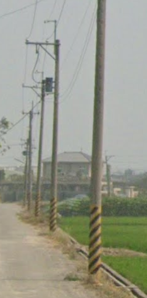
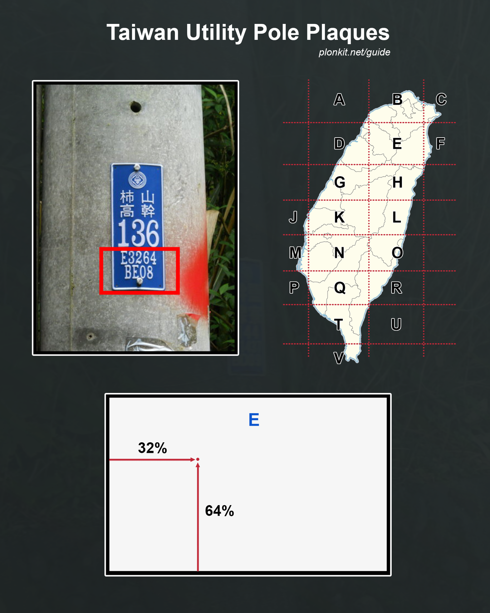
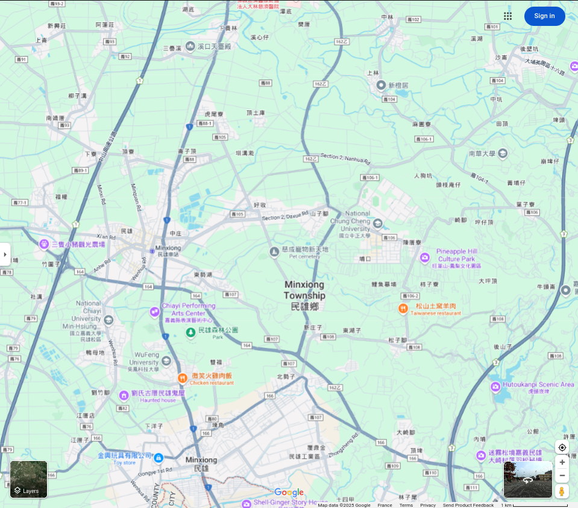
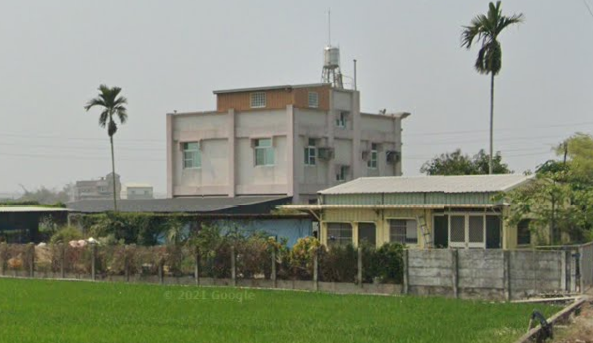

# L3ak CTF 2025 - OSINT : Grain of Truth

* Write-Up Author: [Atlas](https://github.com/Atlas002) - [0xECE](https://www.linkedin.com/company/asso0xece/)
* All credits for the challenge go to [L3ak Team](https://l3ak.team/).

Flag

L3AK{Wh0\_Kn3W\_El3ctr1C\_p0L3S\_W3R3\_so\_Us3FuL!}

## Challenge Description:

[360° View of the challenge](https://geosint.ctf.l3ak.team/L3akCTF-grain_of_truth)

.png>)\
.png>)\
.png>)\
.png>)

## Write up

When first looking around our point of view, we can see flat lands stretching almost as far as the eye can see, along with rice fields and above-grounds electricity poles. This strongly hints towards **Asia**.

Taking a closer look at those poles, we can see some important details, and as eletricity poles are very seldomly uniform across countries, this can give us an edge to know where we are.

We can see that the poles have Yellow and Black stripes on their bottom, which according to [this website](https://www.geometas.com/metas/categories/poles/) narrows down our possible location to either **Taiwan or South Korea**.

Another thing that will narrow down our search even more is the blue plaques on the poles.

.png>)

Doing some research on these plaques leads us to discover that the poles belong to **Taiwan Power Company grid**, meaning we are indeed in **Taiwan**.

Moreover, delving deeper into the subject, we learn that they can act as a **"poor man's GPS"** according to [this website](https://wiki.osgeo.org/wiki/Taiwan_Power_Company_grid), and they're use ressemble this :

Our plaque bears the instructions `K2812`, meaning we are in zone **K**, **28% East** and **12% North**.

With an approximate search, we reduce our search area to this :

Knowing we're on a small road between two field with buildings nearby, we try to narrow down the exact location . We see that we have a building with a terracota red roof nearby :

We find a similar building when sifting through the area in satellite view :

.png>)

Looking around in street view confirms that this is the right spot :

.png>)

We then drop our pin there and get our flag :

.png>)

## Results

`L3AK{Wh0_Kn3W_El3ctr1C_p0L3S_W3R3_so_Us3FuL!}`
