# L3ak CTF 2025 - OSINT : Mountain View

- Write-Up Author:  [Atlas](https://github.com/Atlas002) - [0xECE](https://www.linkedin.com/company/asso0xece/)

- All credits for the challenge go to [L3ak Team](https://l3ak.team/).

Flag

L3AK{y0sh1n0_HAs_gR3At_54KuRA_Bl0s5omS}

## Challenge Description:

[360° View of the challenge](https://geosint.ctf.l3ak.team/L3akCTF-mountain_view)

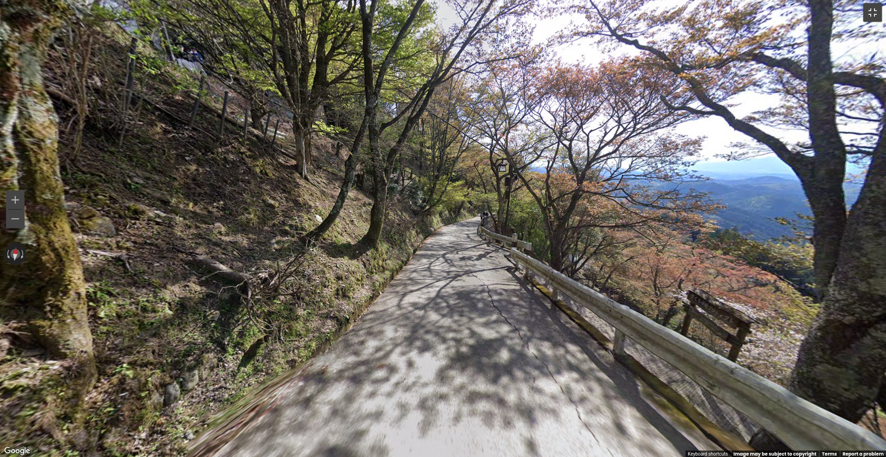  
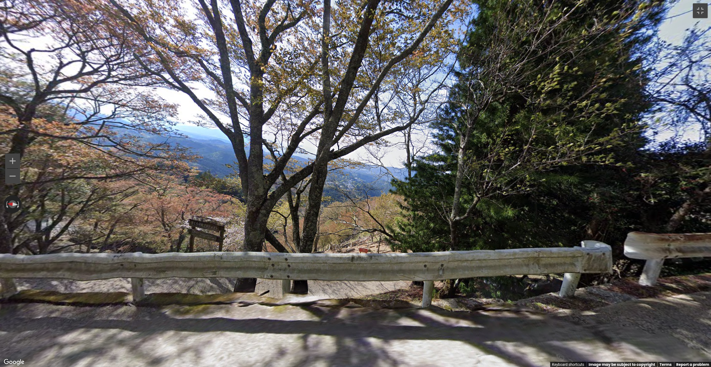  
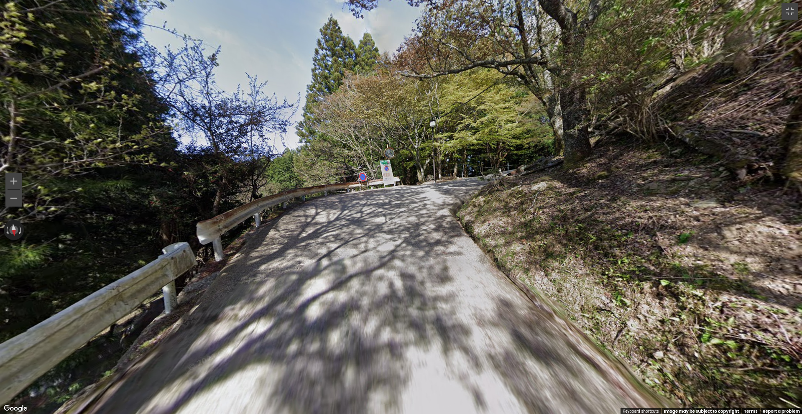  
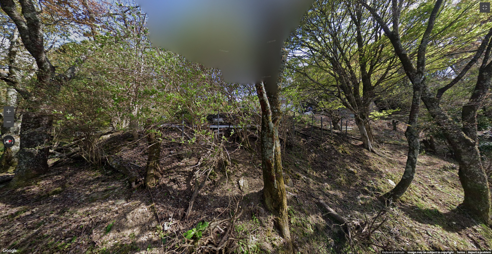  
 
## Write up  

When first looking around, we can see that we're pretty high up on a slope, with mountainous backgrounds and some city in the distance. Paired with some sakura trees we can spot nearby, this is strongly hinting us toward **Japan**.

Then, looking a bit closer we can see a sign with kanji written over it : 

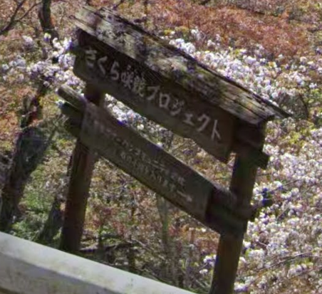

A reverse image search give us a direct hit on it :

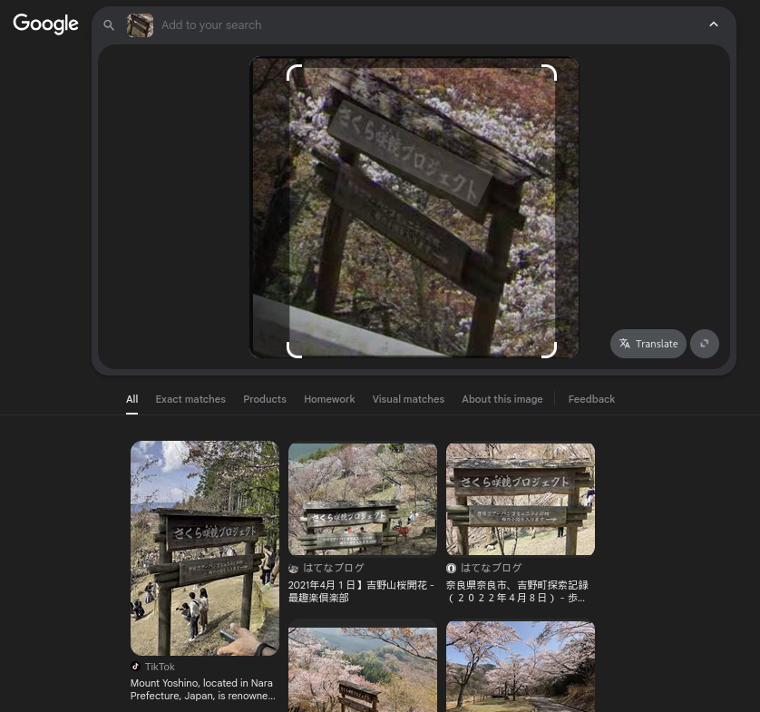  

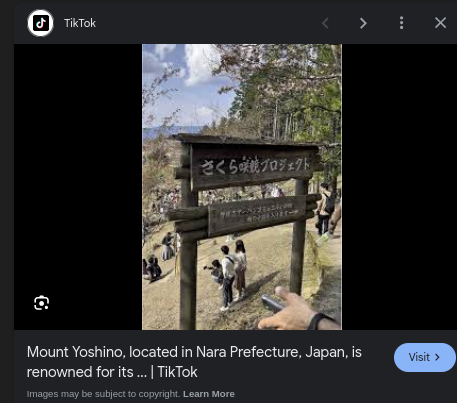  

We now know that we are at **Mount Yoshino, Nara Japan**.

Looking up the place on google maps puts us near the starting point : 

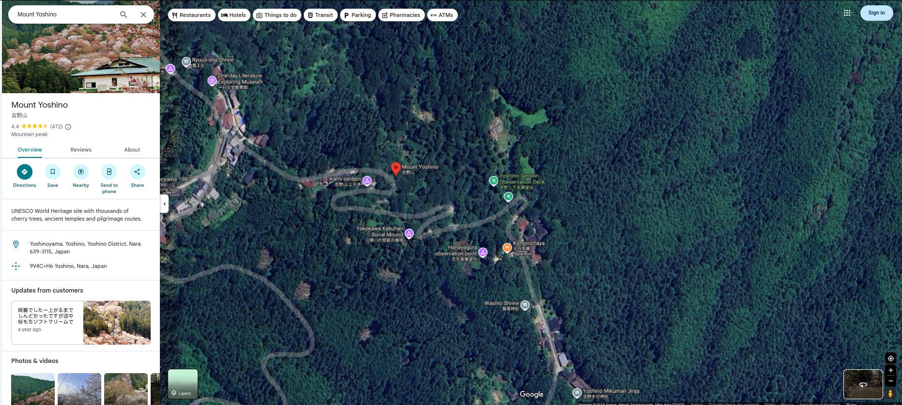

Looking back at the view we've been given, we can see that the sign is below our point of view, that there is a sharp turn to the left behind us and a long stretch of road ahead of us.

Putting these informations together leads us to this spot :

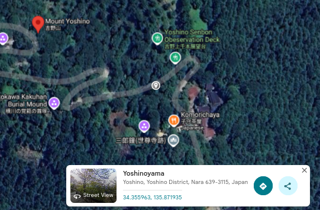

Looking around in street view confirms that this is the right place : 

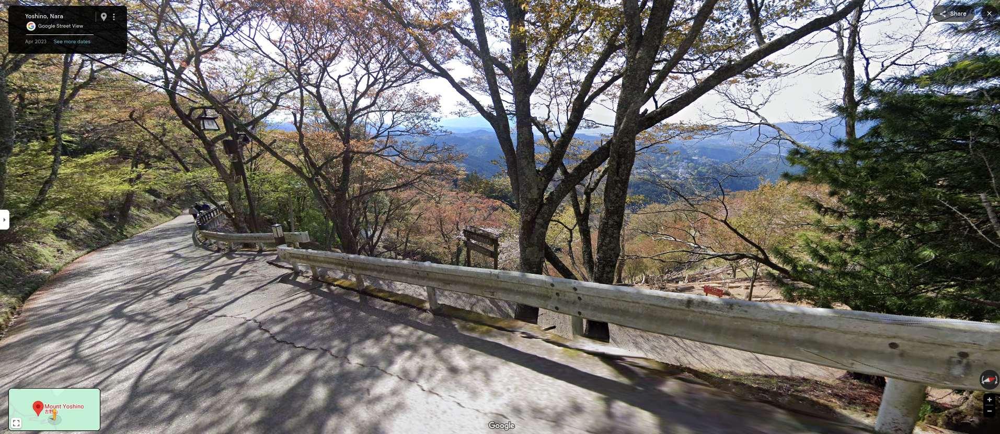

Now the exact spot of the challenge :

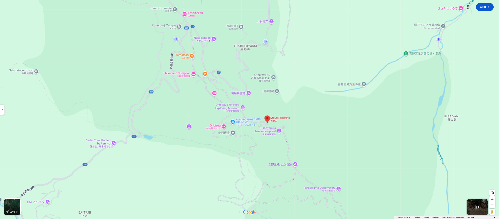

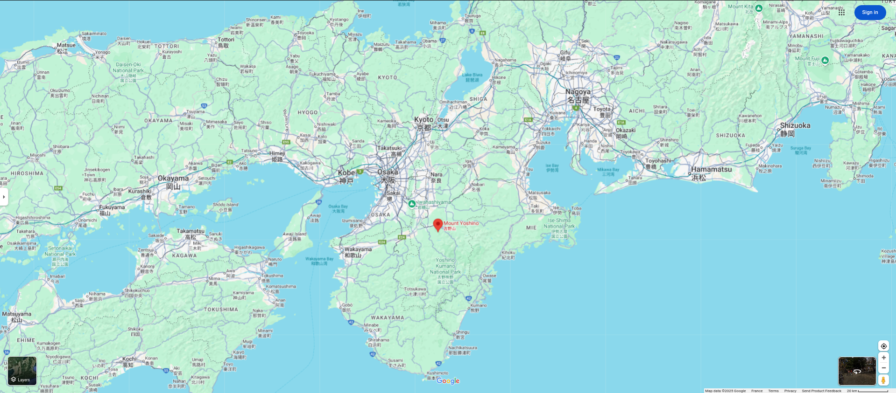

We then drop our pin and get the flag :

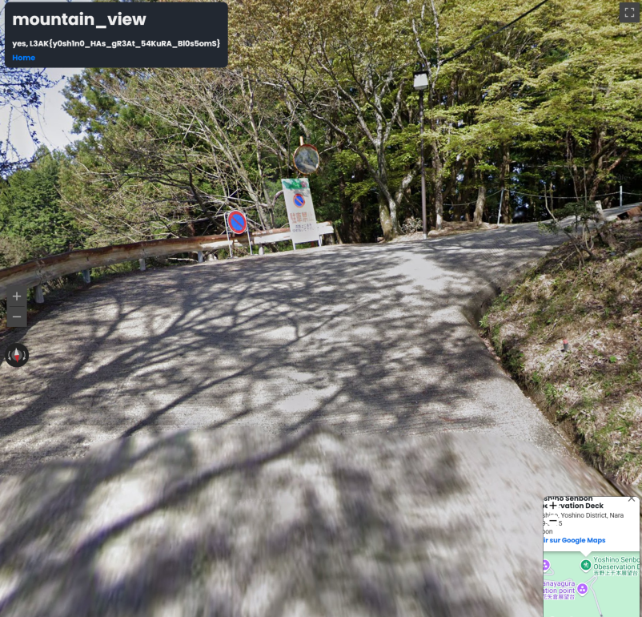

## Results

`L3AK{y0sh1n0_HAs_gR3At_54KuRA_Bl0s5omS}`

 