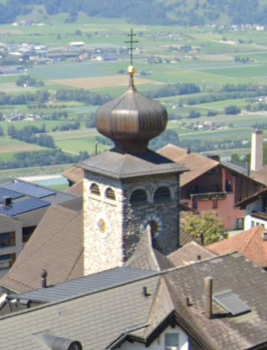
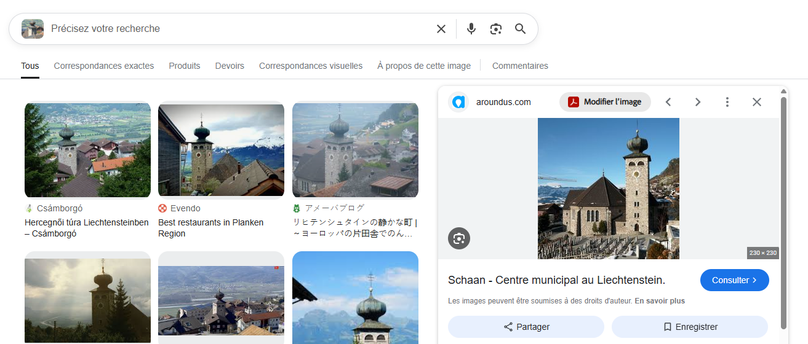
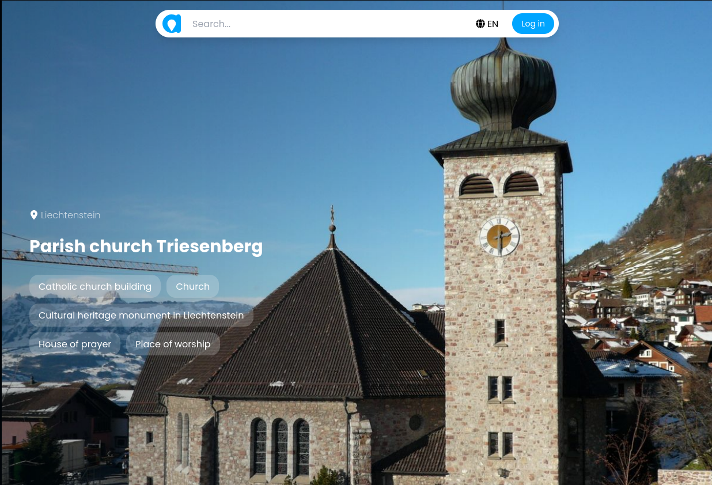

# L3ak CTF 2025 - OSINT : Sunny Day

* Write-Up Author: [Atlas](https://github.com/Atlas002) - [0xECE](https://www.linkedin.com/company/asso0xece/)
* All credits for the challenge go to [L3ak Team](https://l3ak.team/).

Flag

L3AK{sUn5H1Ne\_iN\_L1ecHt3nSTe1n}

## Challenge Description:

[360° View of the challenge](https://geosint.ctf.l3ak.team/L3akCTF-sunny_day)

.png>)\
.png>)\
.png>)\
.png>)

## Write up

When first looking around the view we have, we can see a valley in between mountains with healthy vegetation, hinting us toward Europe.

Looking a bit closer we notice a flag waving in the distance :

.png>)

A quick reverse image search reveals that this is **Liechtenstein's flag**

We can then assume we are in Liechtenstein.

Next we can spot an unusual structure among the building of the town :

Again, reverse image search gives us a hit in **Liechtenstein** which corroborates what we've found so far :

Going on the [result's website](https://aroundus.com/p/5907574-parish-church-triesenberg) we can now see that the building in question is **Triesenberg's parish church**

Now that we know our approximate location, we head over to google maps to find the exact spot :

.png>)

Seeing as the point of view we have is higer up that the church, we head over to the heights of Triesenberg

.png>)

Bingo, we're now at the same point of view as the challenge. Here's the spot of the challenge :

.png>)

.png>)

Dropping a pin to the right place gives us our flag :

.png>)

## Results

`L3AK{sUn5H1Ne_iN_L1ecHt3nSTe1n}`
