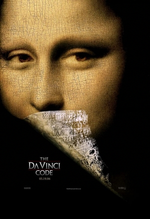

# Shutlock CTF - Misc/Story : Une Affiche Étrange

- Write-Up Author:  [Atlas](https://github.com/Atlas002) 
- All credits for the challenge go to [DGSI - Direction Générale de la Sécurité Intérieure](https://www.dgsi.interieur.gouv.fr/) and [EPITA](https://www.epita.fr/).

Flag

SHLK{casino_barriere_le_croisette}

## Challenge Description:

En explorant le site de ForaCorp, une section dédiée à leurs projets cinématographiques retient l’attention. Parmi les films présentés, The Da Vinci Code intrigue particulièrement. Cette affiche accompagnée d’une étrange phrase semble sortir du lot… Trop étrange pour être anodine. Et si elle cachait quelque chose ?

Format du flag SHLK{intitule_du_lieu}

## Write up  

[Work in Progress]

## Results

`SHLK{casino_barriere_le_croisette}`

Thank you for reading this far, again, huge props to [DGSI - Direction Générale de la Sécurité Intérieure](https://www.dgsi.interieur.gouv.fr/) and [EPITA](https://www.epita.fr/) for coming up with this challenge.
