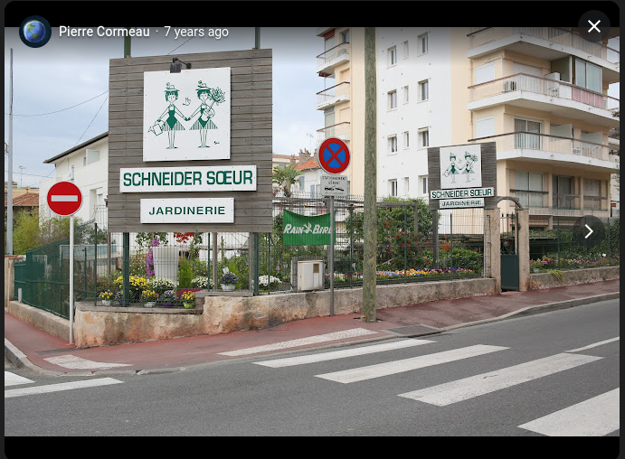
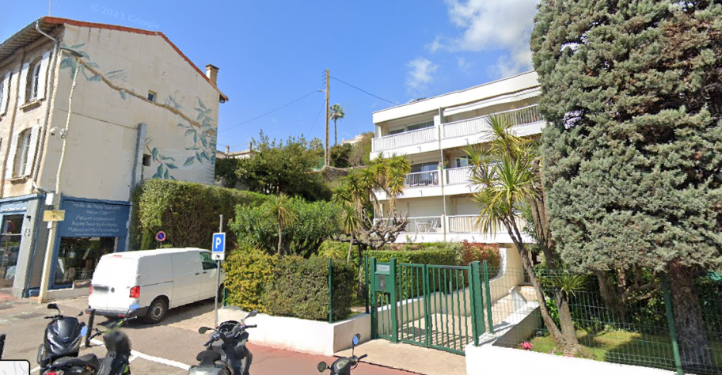
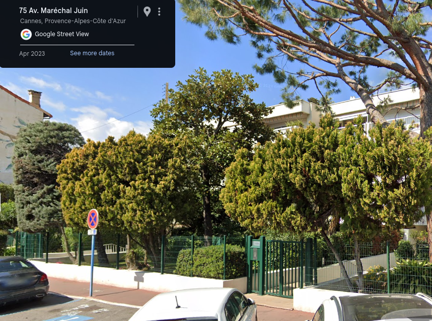

# Shutlock CTF - OSINT/Story : Find The Lab

* Write-Up Author: [Atlas](https://github.com/Atlas002)
* All credits for the challenge go to [DGSI - Direction Générale de la Sécurité Intérieure](https://www.dgsi.interieur.gouv.fr/) and [EPITA](https://www.epita.fr/).

Flag

SHLK{SALANGANE\_3}

## Challenge Description:

En fouillant le site WEB de ForaCorp, nos experts ont trouvé cette image assez intriguante. Elle était accompagnée de cette phrase : "On se retrouve ici, comme d'habitude, on se voit bientôt pour le festival !".

À vous de retrouver où cette photo a été prise. Nous nous devons d'être le plus précis possible. Nous cherchons le nom de la résidence et l'étage depuis lequel la photo a été prise.

Format de flag : SHLK{nomresidence\_etage}

## Write up

Our objective here is to find out the name of the building we're in and which story the photo was taken at.

Looking through the image, we can see two buildings, the one closests to us having a mural. My first instinct was to reverse image search it, however it yielded very little results. Just below that, we see a store that seems to sell home renovations products, but as there are no key identifying informations visible, it also is a dead end.

Our last lead resides in the sign with the children on it. We can see it's appears another time down the street but is cropped off.

Trying to reverse image search it gives us a hit :

This matches the sign we see on the picture. Now we can get the position of that sign :

.png>)

We can see that this is a garden center located in Cannes. Looking around in streetview we can clearly see the building the picture was taken from :

From the way we see the mural and the angle we see the sign at, we can assume the picture was taken from the highest floor, **the 3rd**.

Looking around and dropping a pin on the building gives us it's adress : **75 Avenue Maréchal Juin, Cannes**

To try and find the name of the building, we look up the adress on google :

.png>)

We end up on the HOA website for that adress. On their website we find the last part of our flag :

.png>)

## Results

`SHLK{SALANGANE_3}`

Thank you for reading this far, again, huge props to [DGSI - Direction Générale de la Sécurité Intérieure](https://www.dgsi.interieur.gouv.fr/) and [EPITA](https://www.epita.fr/) for coming up with this challenge.
