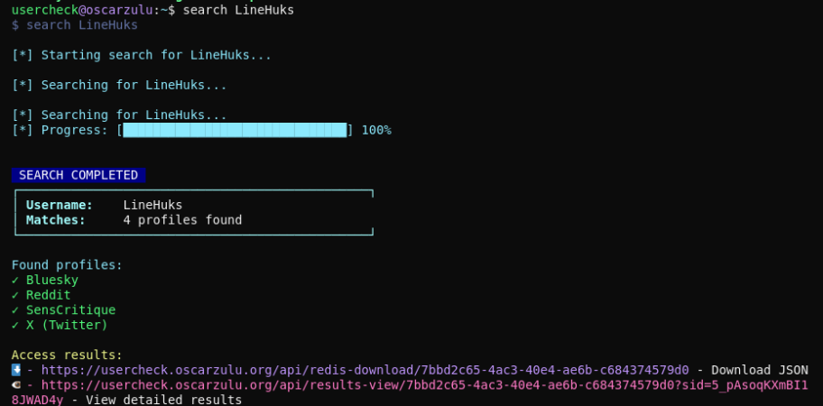
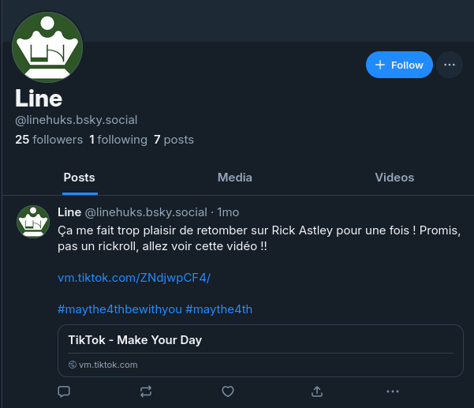
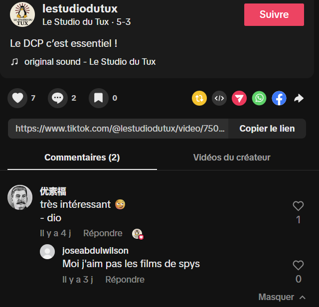

# Shutlock CTF - OSINT/Story : Un Pingouin dans une Botte de Foin

* Write-Up Author: [Atlas](https://github.com/Atlas002)
* All credits for the challenge go to [DGSI - Direction Générale de la Sécurité Intérieure](https://www.dgsi.interieur.gouv.fr/) and [EPITA](https://www.epita.fr/).

Flag

SHLK{LABO\_FOR4\_CO5P}

## Challenge Description:

Nous avons interrogé à l’instant Line Huks, réalisatrice du documentaire « L’s Dead ». Elle nous a confié ne pas avoir souhaité assister à la projection en raison d’un stress intense. Elle a également précisé que le Digital Cinema Package (DCP), le format livré pour la projection, avait été préparé par un laboratoire externe. Ainsi, entre l’export final du film et sa diffusion au festival, de nombreuses personnes auraient potentiellement eu accès au contenu.

Nous vous demandons d’enquêter sur Line Huks et d’en apprendre davantage sur elle. Par ailleurs, nous avons omis de lui demander le nom du laboratoire qui a réalisé le DCP…

## Write up

We know we're trying to get more info on the studio that Line Huks has hired, for that we'll try to find if she has any digital presence.

To do that, we will be using [Oscar Zulu](https://www.linkedin.com/company/oscar-zulu-osint/posts/?feedView=all)'s [Rhino User Checker](https://usercheck.oscarzulu.org/) and searching for the username `LineHuks`, we end up finding a Reddit, X and Bluesky account :

On her [Reddit account](https://www.reddit.com/user/LineHuks/), we can see that she posted on the `r/AujourdhuiJaiAppris` subreddit (equivalent of `r/TodayILearned`) saying that, when you're connected on a tiktok account and you share a link in the type of `vm.tiktok.com`, it can reccomend your personnal account to people who use that link.

.png>)

On her [Twitter/X account](https://x.com/LineHuks), we see that she didn't post anything but has a link to her bluesky profile in her account bio.

.png>)

Heading over to her [Bluesky account](https://bsky.app/profile/linehuks.bsky.social), we can see that she shared a [tiktok video](https://vm.tiktok.com/ZNdjwpCF4/) :

When reading the post she shared about tiktok links, we learn that we need to either emulate or use a phone and not be logged into a tiktok account for the recommandation to appear.

Following these guidelines leads us to this :

We see that we're recommended the tiktok account [**Le studio du Tux**](https://www.tiktok.com/@lestudiodutux)

Heading over to the tiktok account, we can see that they have several videos, one of which is labeled with "Le DCP c'est essentiel!". As we're looking for the studio that handled her movie's DCP, this looks like a strong hint :

Indeed, while watching through the video we can see the flag appear around the 30 seconds mark :

.png>)

## Results

`SHLK{LABO_FOR4_CO5P}`

Thank you for reading this far, again, huge props to [DGSI - Direction Générale de la Sécurité Intérieure](https://www.dgsi.interieur.gouv.fr/) and [EPITA](https://www.epita.fr/) for coming up with this challenge.
