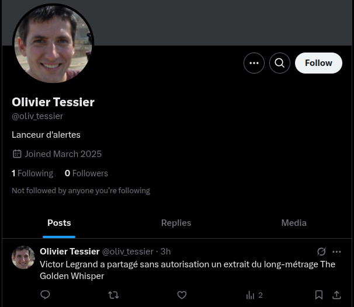
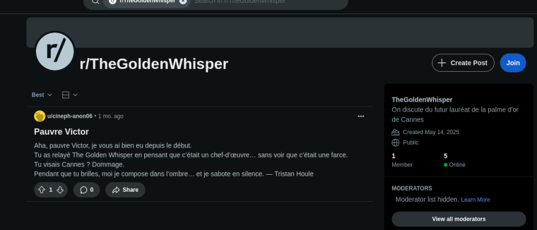

# Shutlock CTF - OSINT : Whispers of Envy 1/2 

- Write-Up Author:  [Atlas](https://github.com/Atlas002) 
- All credits for the challenge go to [DGSI - Direction Générale de la Sécurité Intérieure](https://www.dgsi.interieur.gouv.fr/) and [EPITA](https://www.epita.fr/).

Flag

SHLK{tristan_houle}

## Challenge Description:

Victor Legrand, candidat à la DGSI, est accusé par un compte nommé @oliv_tessier (Olivier Tessier) sur X, d'avoir fait fuiter un film très attendu au Festival de Cannes 2025. Vérifiez les déclarations d'Olivier Tessier et démasquez l'auteur de la fuite.

Flag attendu : SHLK{prenom_nom}

## Write up  

Heading over on twitter, we take a look at Olivier's account : 

We can see that he's indeed mentioning Victor Legrand, and he's accusing him of leaking the feature-length movie **The Golden Whisper**.

Knowing Vicotr is not the real culprit, we try to gather as much information as possible on this movie.  

While doing so, we end up finding a subreddit named **r/TheGoldenWhisper** with this as it's only post : 

We can see that this revendication letter is signed by a **Tristan Houle**, which is our flag

## Results

`SHLK{tristan_houle}`

Thank you for reading this far, again, huge props to [DGSI - Direction Générale de la Sécurité Intérieure](https://www.dgsi.interieur.gouv.fr/) and [EPITA](https://www.epita.fr/) for coming up with this challenge.
